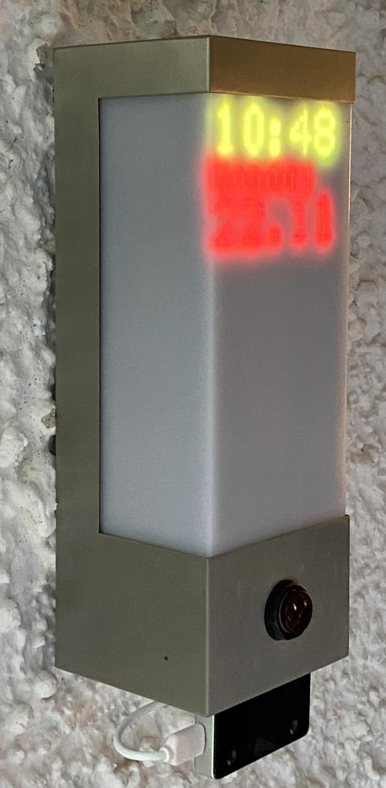

<p align="center">
  <a href="" rel="noopener">
 </a>
</p>

<h3 align="center">smartdoorF455</h3>

<div align="center">


[](/LICENSE)

</div>

---

<p align="center"> With the introduction of the iPhone X in September 2017, Apple introduced authentication with biometric facial features as a reliable technology in our everyday lives. With this project, we want to bring this process as a door opener from the smartphone to the smart home. 
    <br> 
</p>

## 📝 Table of Contents

- [About](#about)
- [Getting Started](#getting_started)
- [Prerequisites](#prerequs)
- [Software Installation](#install)
- [Usage](#usage)
- [Video](#video)
- [Hardware Documentation](#documentation)
- [Built Using](#built_using)
- [Author](#author)
- [Acknowledgments](#acknowledgement)

## 🧐 About <a name = "about"></a>

Early 2021 Intel announced the RealSense ID F455 camera, which picks up the principle of 3D facial authentication and offers makers an interesting product for integration into self-constructed solutions. The camera scores with extensive documentation, an open source SDK for Linux, Windows and Android as well as the languages C, C++, C# and Python. In contrast to Apple, it allows the authentication of more than one person, whose profiles are either stored centrally on a server or in a database on the camera itself. The RealSense ID F455 is therefore the perfect candidate for opening our front door using 3D face recognition with a similarly low error rate as Apple's iPhone.

<a href="" rel="noopener">
 </a>

## 🏁 Getting Started <a name = "getting_started"></a>

If you think about building a smart door opener with 3D facial authentication, please first look out for an IP interface to the door buzzer. This is the tricky part for a possible replica of this application and this may require creativity at your end, as the requirements are very different from door to door. We found a Siedle brand bus-based door opener for this project. Depending on the door intercom and the IP gateway, the code for must be adjusted accordingly. We have marked this  in the code with "TRIGGER DOOR OPENER START" and "TRIGGER DOOR OPENER END". If you do not use an MQTT for the communication to open the door, you can comment out the line #define MOSQUITTO_IN_USE, or remove or adapt the lines enclosed with these #ifdef's.

## 🔨 Prerequisites <a name = "prerequs"></a>

The hardware required for this maker projekt is about ~500 USD in total not including an IP gateway to the door buzzer.

- Intel RealSense ID F455 camera
- Raspberry PI 4B, >= 4 GB RAM running Raspberry Pi OS 
- Micro SD card >= 16 GB
- 5V power supply e.g. Meanwell IRM-60-5ST 5V 10A 
- casing e.g. outdoor lamp with sensor Severina by Lindby 
- RGB LED 64x32 P2,5 Matrix with 160x80 mm dimensions e.g. Adafruit 5036 
- E18-D80NK IR photoelectric barrier 
- 10 kΩ pull up resistor
- 40 pin GPIO ribbon cable or 20x female/female jumper cable
- 4x 40mm, 4x15mm, 2x 10mm M3 spacer bolts for the LED Matrix
- 8x M3 screw nuts for fastening the spacer bolts to the housing plate
- 4x M2,5 12mm screws for attaching the Raspi to the housing plate
- ¼ inch screw for fastening the camera on the underside of the housing
- IP-based interface to the door buzzer. This code assumes an MQTT interface 
  as we found a "Siedle Bus" based door intercom and use a MQTT Siedle gateway from Oskar Neumann
- Optional: Geeek Pi Raspberry Pi 4 Armor Case
- Optional: Adafruit RGB Matrix Bonnet
- Optional: 40 Pin Pitch Stacking Header – to increase the distance between the matrix bonnet and the board so that it protrudes over the armor case
- Optional: PIR Sensor HC-SR 501 as an alternative presence sensor for the photoelectric barrier 


## 💾 Software Installation <a name = "install"></a>

The program "smartdoorF455" is available in C and C++ flavour and should be adapted to your needs.
Depending on whether you use the Adafruit Matrix Bonnet to connect the LED matrix, whether the Intel RealSenseID camera is tilt face-down or whether you use a PIR sensor - with a low-to-high transition for presence indication - or a infrared photoelectric barrier - with a high-to-low transition for presence indication to trigger the authentication via camera: This this needs to be configured in the marked SYSTEM CONFIGURATION SECTION of the code.

Here's how to build the code, assuming a clean installed Raspberry Pi OS:
```
# installation of smartdoorF455
# bring Raspi up2date and get additional software developement tools
sudo apt update -y
sudo apt upgrade -y
# install essential development tooling
sudo apt install cmake build-essential -y
# mosquitto is the MQTT broker
sudo apt install mosquitto mosquitto-dev libmosquittopp-dev mosquitto-clients -y
# libgraphicsmagick++-dev is required to build rpi-rgb-led-matrix utilities
sudo apt install libgraphicsmagick++-dev libwebp-dev -y
# you may want to encrypt network communication
sudo apt install libssl-dev libcurl4-openssl-dev -y
# let's build the RealSense ID SDK by Intel
cd ~
git clone https://github.com/IntelRealSense/RealSenseID.git
cd RealSenseID
mkdir build
cd build
cmake .. 
make -j4
# let's build the rpi-rgb-led-matrix library by Henner Zeller
cd ~
git clone https://github.com/hzeller/rpi-rgb-led-matrix.git
cd rpi-rgb-led-matrix/
make -C examples-api-use
# let's build the smartdoorF455 application
cd ~
git clone https://github.com/joergwall/smartdoorF455.git
cd smartdoorF455
mkdir build
cd build
cmake ..
make -j4
```


## 🎈 Usage <a name="usage"></a>

Now there should be 2 executable files in the ~/smartdoorF455/bin directory - the c and c++ Version. To start them use sudo:

```
sudo ~/smartdoorF455/bin/smartdoorF455 

```
## 🎥 Video <a name = "video"></a>

Here's a video with a quick demonstration of the functionality can be found here:

[](https://www.youtube.com/watch?v=hRnp7CBBR0Q)

## 📜 Hardware Documentation <a name = "documentation"></a>

Further documentation of this project including hardware setup is planned to be released in the German [heise Make](https://www.heise.de/make/projekte/) journal. 

## ⛏️ Built Using <a name = "built_using"></a>

- [pigpio](https://github.com/joan2937/pigpio) - API to address GPIO of Raspberry PI
- [RealSenseID](https://github.com/IntelRealSense/RealSenseID) - SDK for Intel RealSenseID F455
- [rpi-rgb-led-matrix](https://github.com/hzeller/rpi-rgb-led-matrix) - Henner Zeller's API to LED Matrix Displays

## ✍️ Author <a name = "author"></a>

- [Joerg Wallmersperger](https://github.com/joergwall) - Maker and User of smartdoorF455 

## 🎉 Acknowledgements <a name = "acknowledgement"></a>

- [Olaf](https://github.com/oreineke) - Inspiration and Tech Support
- [Oskar Neumann](https://github.com/oskarn97) - Providing a MQTT Gateway to my door intercom
