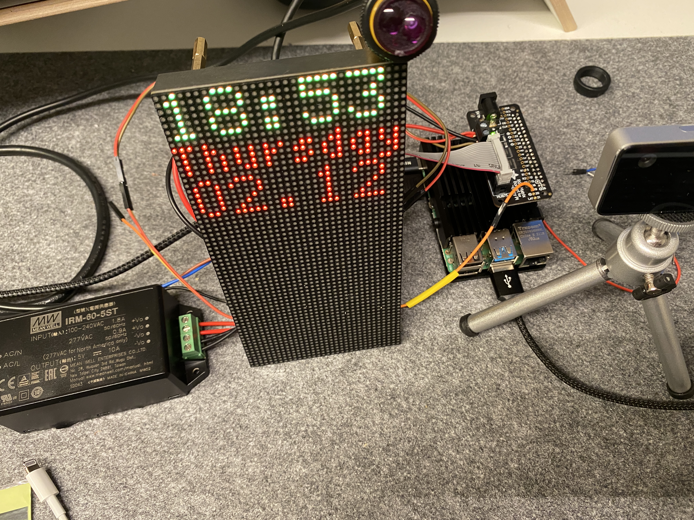
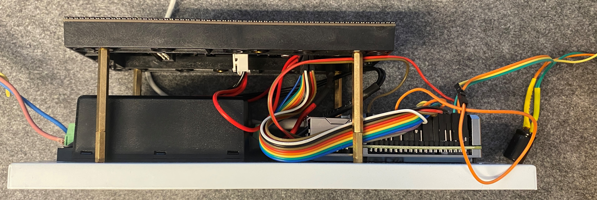
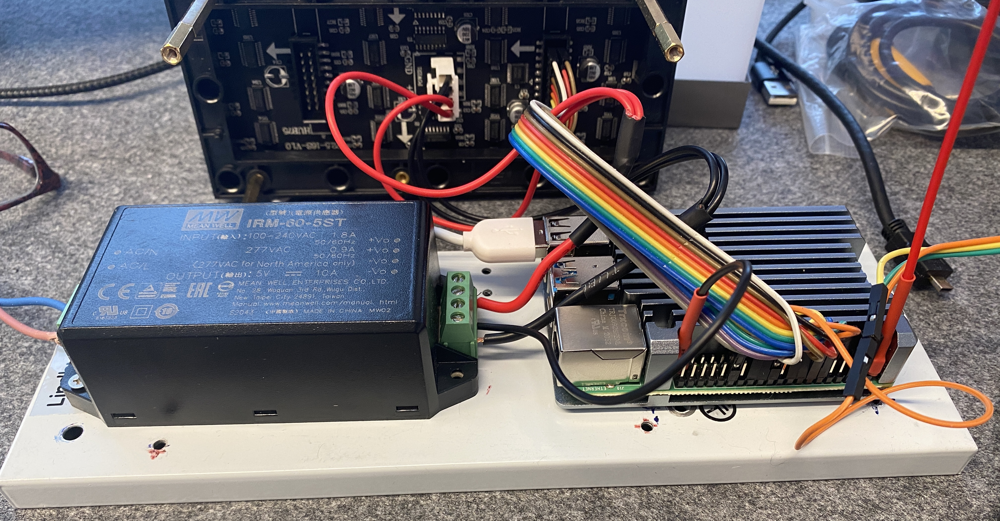
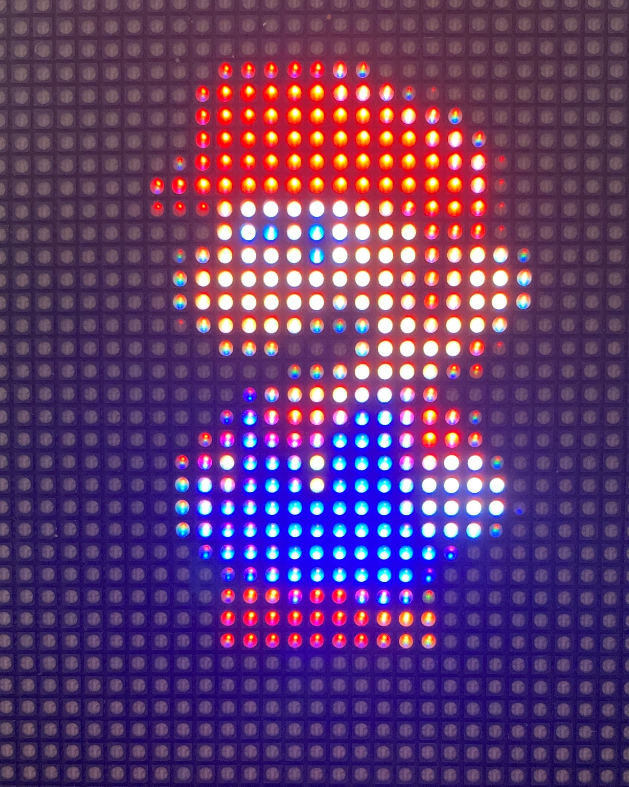

<p align="right">
  <a href="./README_DE.md" rel="noopener">GERMAN VERSION</a>
<p align="center">
  <a href="" rel="noopener">
 </a>
</p>

<h3 align="center">smartdoorF455</h3>

<div align="center">


[](/LICENSE)

</div>

---

<p align="center">With the introduction of the iPhone X in September 2017, Apple introduced authentication with biometric facial features as a reliable technology in our everyday lives. With this project, we want to bring this process as a door opener from the smartphone to the smart home. 
    <br> 
</p>

## 📝 Table of Contents

- [About](#about)
- [Getting Started](#getting_started)
- [Prerequisites](#prerequs)
- [Functionality](#functionality)
- [Hardware Setup](#hardware_setup)
- [Wiring](#wiring)
- [Presence Sensor](#presence_sensor)
- [Case Installation](#case_installation)
- [Software Installation](#install)
- [Usage](#usage)
- [Teach faces for authentication](#teach_faces)
- [System Configuration](#system_configuration)
- [Open Sesame](#open_sesame)
- [Camera Security](#camera_security)
- [End of Life of Intel ReaSenseID F455](#end_of_life)
- [Troubleshooting](#troubleshooting)
- [Ideas for Changes and Enhancements](#changes_enhancements)
- [Conclusion](#conclusion)
- [Video](#video)
- [Built Using](#built_using)
- [Author](#author)
- [Acknowledgments](#acknowledgement)

## 🧐 About <a name = "about"></a>

Early 2021 Intel announced the RealSense ID F455 camera, which picks up the principle of 3D facial authentication and offers makers an interesting product for integration into self-constructed solutions. The camera scores with extensive documentation, an open source SDK for Linux, Windows and Android as well as the languages C, C++, C# and Python. In contrast to Apple, it allows the authentication of more than one person, whose profiles are either stored centrally on a server or in a database on the camera itself. The RealSense ID F455 is therefore the perfect candidate for opening our front door using 3D face recognition with a similarly low error rate as Apple's iPhone.

<a href="" rel="noopener">
 </a>

## 🏁 Getting Started <a name = "getting_started"></a>

If you think about building a smart door opener with 3D facial authentication, please first look out for an IP interface to the door buzzer. This is the tricky part for a possible replica of this application and this may require creativity at your end, as the requirements are very different from door to door. We found a Siedle brand bus-based door opener for this project. Depending on the door intercom and the IP gateway, the code for must be adjusted accordingly. We have marked this  in the code with "TRIGGER DOOR OPENER START" and "TRIGGER DOOR OPENER END". If you do not use an MQTT for the communication to open the door, you can comment out the line #define MOSQUITTO_IN_USE, or remove or adapt the lines enclosed with these #ifdef's.

## 🔨 Prerequisites <a name = "prerequs"></a>

The hardware required for this maker projekt is about ~500 USD in total not including an IP gateway to the door buzzer.

- Intel RealSense ID F455 camera
- Raspberry PI 4B, >= 4 GB RAM running Raspberry Pi OS 
- Micro SD card >= 16 GB
- 5V power supply e.g. Meanwell IRM-60-5ST 5V 10A 
- casing e.g. outdoor lamp with sensor Severina by Lindby 
- RGB LED 64x32 P2,5 Matrix with 160x80 mm dimensions e.g. Adafruit 5036 
- E18-D80NK IR photoelectric barrier 
- 10 kΩ pull up resistor
- 40 pin GPIO ribbon cable or 20x female/female jumper cable
- 4x 40mm, 4x15mm, 2x 10mm M3 spacer bolts for the LED Matrix
- 8x M3 screw nuts for fastening the spacer bolts to the housing plate
- 4x M2,5 12mm screws for attaching the Raspi to the housing plate
- ¼ inch screw for fastening the camera on the underside of the housing
- IP-based interface to the door buzzer. This code assumes an MQTT interface 
  as we found a "Siedle Bus" based door intercom and use a MQTT Siedle gateway from Oskar Neumann
- Optional: Geeek Pi Raspberry Pi 4 Armor Case
- Optional: Adafruit RGB Matrix Bonnet
- Optional: 40 Pin Pitch Stacking Header – to increase the distance between the matrix bonnet and the board so that it protrudes over the armor case
- Optional: PIR Sensor HC-SR 501 as an alternative presence sensor for the photoelectric barrier 

## Functionality <a name = "functionality"></a>
The smart door opener has replaced the outdated entrance lighting and is therefore housed in the casing of one. The system is only supplied with main voltage and communicates via the in-house WIFI. It must therefore be ensured that the location of the admission control has an appropriate WIFI reception.


*smart door opener in the guise of an outdoor lighting*

Since the camera itself does not have a presence detector, it is triggered by an infrared reflex light barrier. The person asking for admission wipes their hand past the light barrier or comes a little closer with their face. A faint red glow from the infrared illuminator of the upside-down camera at the bottom of the case can be seen briefly. The camera now projects invisible infrared points with a wavelength of 850 nm onto the face, records them with two full HD cameras integrated on the side and uses them to form a three-dimensional point cloud, which it compares with the stored face profiles via AI inference. The camera needs less than a second for this authentication process and transfers the result - in the positive case the name of the recognized person - to the Raspberry Pi computer via USB cable. Since we only use one camera, these profiles are stored locally on the camera. For authentication with multiple accesses, the camera offers a server mode in which the access profiles are stored on a central server and can thus be used by multiple cameras. If the authentication is positive, the name of the recognized person is shown on the LED matrix display for a few seconds and the door is opened via MQTT command via WIFI. When idle, the LED matrix panel shows the time, the day of the week and the current date.
You can find a demonstration of how it works via YouTube video here:

[](https://www.youtube.com/watch?v=hRnp7CBBR0Q)

*Youtube - how the smart door opener with 3D face recognition works*

## Hardware Setup <a name = "hardware_setup"></a>
A Raspberry 4B with Raspberry PI OS aka Raspian is used as the host computer. We decided on an outdoor light in a stainless steel housing for the housing, which gives off an inconspicuous image when placed in front of the front door. In addition to the Raspi, it contains a 5V power supply with 50 watts of power, a retro-reflective sensor and an Adafruit 5036 LED matrix display with a resolution of 64x32 RGB LEDs. This is attached to the base plate of the housing using 4 spacer bolts, each with an added length of 55 mm (40 mm + 15 mm). The matrix module has a thickness of 15 mm, resulting in a distance of 70 mm between the base plate and the frosted acrylic glass. To ensure that the LED matrix content does not become too blurred due to the satin finish, it is important that the LED matrix module is in direct contact with the acrylic glass.
Before the structure is integrated into the dismantled lamp housing, the components are wired as a prototype and the functionality of the individual components and the system is tested.


*first test in the prototype structure*

## Wiring <a name = "wiring"></a>
There are 2 options for connecting the RGB matrix display to the Raspberry PI:
1. Adafruit RGB Matrix Hat/Bonnet:
This plug-in board offers tidy cabling via the HUB75 connector, which is included with the LED matrix module. In order to avoid that the plug-in board does not get in the way of the Raspi Armor Case, it must be raised using a 40-pin pitch stacking header. This creates the disadvantage of a higher design of approx. 6 cm. Since the Raspi is installed in the lower part of the housing opposite the sensor, this is OK for using the PIR sensor HC-SR 501, but leads to a collision when assembling the E18-D80NK IR light barrier with a housing length of 5.5 cm of the lamp housing. Therefore, when using the E18-D80NK light barrier, we recommend either the discrete wiring shown below or swapping places - power supply unit in the lower part of the housing, Raspi in the upper part!
The Raspi is powered via the jack plug or the screw terminals on the Adafruit Bonnet. In addition, the Adafruit Bonnet uses other [GPIO](https://www.heise.de/tipps-tricks/Raspberry-Pi-Das-koennen-die-GPIO-Pins-4583823.html) Ports for communication, so in Adafruit Bonnet case we use GPIO 19 for the presence sensor. A jumper cable for the sensor output must therefore be soldered onto the bonnet.


*Wiring with Adafruit Matrix Bonnet to Pitch Stacking Header soldered to GPIO19 with jumper wire over armor case*

2. Discrete wiring with 40-pin GPIO ribbon cable or female-to-female jumper cable <a name = "discrete-wiring"></a>



*discreet wiring, LED matrix with 55mm spacer bolts wrap around Raspi and power supply*


‚
*discrete wiring with jumper cable*

The discrete wiring using jumper or ribbon cables is a little more fiddly but just as functional. The presence sensor (PIR or photoelectric sensor) is used in the case of discrete wiring to connect to [GPIO Pin 5](https://www.heise.de/tipps-tricks/Raspberry-Pi-Das-koennen-die-GPIO-Pins-4583823.html). The Meanwell power supply has a 4-pin screw terminal at the low-voltage output, which supplies power to both the RGB matrix via the power cable included in the scope of delivery and the Raspi via GPIO pin 2 for 5V and GPIO pin 39 for GND. We do not recommend using the jumper cables for powering the Raspi, but rather using a thicker cable with higher cross-section and snappier terminals. To do this, we rededicated 2 redundant cable clamps from the LED Matrix power supply, pulled them out with a small screwdriver and covered them with shrink tubing so that there is no risk of short circuits on GPIO pin 2.


*Repurposing of two 5V power cables from the LED matrix module to supply the Raspis*

The instructions for the discrete wiring of the LED matrix module are shown in detail here:
[https://github.com/hzeller/rpi-rgb-led-matrix/blob/master/wiring.md](https://github.com/hzeller/rpi-rgb-led-matrix/blob/master/wiring.md)


*camera face down mounted on the bottom of the casing*

The camera is attached upside down on the underside of the housing. A USB-C cable, which is included with the camera, is fed into the housing through a hole to be drilled behind the camera and plugged into one of the 4 USB-A ports on the Raspberry Pi.

## Presence Sensor <a name = "presence_sensor"></a>
The frontal housing hole, which was reserved for the lens of the PIR sensor, is filled with the reflex infrared light barrier by screwing it on the inside and outside with the two enclosed plastic nuts. The sensor is supplied with a voltage of 5V via the matrix bonnet. The brown cable is routed to the terminal labeled "5V Out" - if the Adafruit Matrix Bonnet is used.

With discrete wiring, there are several ways to obtain 5V voltage from the [GPIO](https://www.heise.de/tipps-tricks/Raspberry-Pi-Das-koennen-die-GPIO-Pins-4583823.html) pins. E.g. +5V on pin 4 and GND - blue cable - on pin 34. The sensor output - black cable - is connected to pin 29 or logical GPIO port 5.

If you don't have a wall opposite or a similar object that reflects infrared light, you can use a PIR sensor, e.g. the HC-SR 501, instead of the light barrier. In our case, this registered many false positive events and thus frequently triggered the camera, since the LED matrix module flickers invisibly to the human eye and irritated the PIR sensor through an opposite wall.

## Case installation <a name = "case_installation"></a>
The housing of the Severina by Lindby sensor-controlled outdoor wall light  is made for the RGB LED matrix with dimensions of 160 mm x 80 mm and offers just enough space to house all components. To mount it, you have to drill a few holes in the rear panel.


*Rear panel with additional drill holes*

The camera is screwed to the lower stainless steel sheet from the inside of the housing with a ¼ inch screw. In order to prevent the valuable camera from simply twisting off, it is secured with two spacer bolts of 10 mm in length.


*Spacer bolts as anti-theft device and still missing cable grommet 😮*


## 💾 Software Installation <a name = "install"></a>

The program "smartdoorF455" is available in C and C++ flavour and should be adapted to your needs.
Depending on whether you use the Adafruit Matrix Bonnet to connect the LED matrix, whether the Intel RealSenseID camera is tilt face-down or whether you use a PIR sensor - with a low-to-high transition for presence indication - or a infrared photoelectric barrier - with a high-to-low transition for presence indication to trigger the authentication via camera: This this needs to be configured in the marked SYSTEM CONFIGURATION SECTION of the code.

Here's how to build the code, assuming a clean installed Raspberry Pi OS:
```
# installation of smartdoorF455
# bring Raspi up2date and get additional software developement tools
sudo apt-get update
sudo apt-get upgrade
sudo apt-get install cmake build-essential -y
sudo apt-get install mosquitto mosquitto-dev libmosquittopp-dev -y
sudo apt-get install libgraphicsmagick++-dev libwebp-dev -y 

# smartdoorF455
git clone https://github.com/joergwall/smartdoorF455.git
cd smartdoorF455
mkdir build
cd build
cmake -Wno-dev ..
make -j4
sudo make install
```


## 🎈 Usage <a name="usage"></a>

The compiled C++ binary executable "smartdoorF455" should now exist in the ~/smartdoorF455/bin directory. The source codes can be found in ~/smartdoorF455/cpp or ~/smartdoorF455/c. The program is started via shell script with sudo:

```
cd ~/smartdoorF455/bin
sudo ./run_smartdoorF455.sh 
```

and provides the following output depending on the user name and time/date:
```
/home/pi/log created
smartdoorF455 started successfully
watch /home/pi/log/20211216_092446_smartdoorF455.log for errors
```

Even if the camera has not yet rehearsed a face, the time, the day of the week and the date should now be visible. If this is not the case, please go to the chapter [Troubleshooting](#Troubleshooting). To abort the program, please use the martial command:
```
sudo killall smartdoorF455
```

## Teach faces for authentication <a name = "teach_faces"></a>
In order to bring the face of authorized users into the camera, we use a tool with a command line interface. If the device /dev/ttyACM0 is missing, use /dev/ttyACM1 instead. The parameters currently stored in the camera and a selection menu now appear. The rotation parameter can be set to 0 in the "s" menu or upside down to 180 depending on whether the camera is positioned upside down - i.e. depending on whether the camera is screwed upside down on the housing or upright, e.g. on the included mini tripod. The menu item "e" offers training with local profile storage on the camera. The face should be about 30 to 50 cm away from the camera. The procedure then looks like this:
```
# enroll user for authentication
# install RealSense ID SDK by Intel
git clone https://github.com/IntelRealSense/RealSenseID.git
cd RealSenseID
mkdir build
cd build
cmake .. -DRSID_PREVIEW=1
make -j4
cd ~/RealsenseID/build/bin
sudo ./rsid-cli /dev/ttyACM0
Connected to device

Authentication settings::
 * Rotation: 0 Degrees
 * Security: High
 * Algo flow Mode: All
 * Face policy : Single
 * Dump Mode: CroppedFace
 * Matcher Confidence Level : High
Please select an option:

  'e' to enroll.
  'a' to authenticate.
  'd' to delete all users.
  'c' to capture images from device.
  's' to set authentication settings.
  'g' to query authentication settings.
  'u' to query ids of users.
  'n' to query number of users.
  'b' to save device's database before standby.
  'v' to view additional information.
  'x' to ping the device.
  'q' to quit.
  
server mode options:
  'E' to enroll with faceprints.
  'A' to authenticate with faceprints.
  'U' to list enrolled users
  'D' to delete all users.
> e
User id to enroll: Julia
Connected to device
  *** Hint Success
  *** Hint Success
```
This way the facial profiles of all authorized persons are learned. When assigning a name, note that the RGB LED matrix module can only display a small number of letters. With the font we use, these are only 5 characters. If necessary, please use an abbreviation or reduce the size of the BDF font for the abbreviation in line 99 of the source code, so that up to 8 characters can be displayed in one line:
```
#define FONT_NAME FONT_PATH "4x6.bdf"
```

## System configuration  <a name = "system_configuration"></a>
To adapt the system according to your configuration, please edit the file src/config.toml.

```
# This is a TOML config file for smartdoorF455
title = "TOML configuration file for smartdoorF455"

[raspi]
gpio_sensor_pin = 19 # use 19 as sensor input pin, if Adafruit Bonnet is used else use pin 5
gpio_sensor_pull = 2 # int value: 0=PUD_OFF, 1=PUD_DOWN, 2=PUD_UP,
                     # depending on the presence sensor used, the gpio_sensor_pin 
                     # needs to be pulled up (5V) or down (GND). Values are documented in WiringPI
                     # library, see https://github.com/WiringPi/WiringPi
wait_time_until_reauthentication = 5 # wait time until next reauthentication becomes possible again in seconds

[mosquitto] # MQTT used for door intercommunication  
use_mosquitto = true
host = "localhost"
port = 1884
keepalive = 600
client_id = "smartdoorF455" # unique client_id
topic_door = "siedle/exec" # topic to manage door intercommunication
topic_control = "smartdoorF455" # topic to manage interactions like e.g. user enrollment

[camera] # see https://github.com/IntelRealSense/RealSenseID/blob/master/include/RealSenseID/DeviceConfig.h for camera config data
         # as this may be altered for future camera software versions
camera_rotation = "0" #  string values: 0 (default), 90, 180, 270
security_level = "Low" # string values: High, Medium, Low (default) 
                       # increasing to Medium or High causes too many
                       # false spoof reports 
                       # (my experience, Version 1.3.1 / May 2025)
algo_flow = "All" # string values: All, FaceDetectionOnly (default), SpoofOnly, RecognitionOnly
dump_mode = "CroppedFace" # string values: None (default), CroppedFace, FullFrame
matcher_confidence_level = "High" # string values: High, Medium, Low (default)
frontal_face_policy = "Moderate" # string values: Strict, Moderate, None (default)
max_spoofs = 0 # integer value: Specifies the maximum number of consecutive spoofing attempts allowed before the device rejects further authentication requests.
gpio_auth_toggling = 0 # integer value: Controls whether GPIO toggling is enabled(1) or disabled(0, default) after successful authentication.

[matrix_options] # options for LED matrix display
hardware_mapping = "adafruit-hat" # string value: adafruit-hat or "" empty string. Specifies, how LED matrix display is connected to Raspberry gpio_sensor_pin
brightness = 80 # integer value for brightness in percent from 0..100
pixel_mapper_config = "Rotate:270" # string values: "Rotate:0", "Rotate:90", "Rotate:180", "Rotate:270"
clock_color = [255, 255, 0] # array of int with values from 0..255
date_color = [255, 28, 0] 
day_color = [255, 28, 0]
username_color = [255, 0, 255]
bg_color = [0, 0, 0] # default: background black
outline_color = [0, 0, 0] # default: no outline

[telegram] # optional: share event messages with telegram bot 
use_telegram = false
bot_token = "[enter your telegram bot_token here]" 

# obtain chat_id from https://api.telegram.org/bot<YourBOTToken>/getUpdates
# to send a test message via browser->bot->telegram, use such a http request
# https://api.telegram.org/bot<bot_token>/sendMessage?text="just%20a%20test%20message"&chat_id=<chat_id>

# chat_id = [enter chat_id number here] 
send_snapshot = true # send a photo of authentication attempts via given telegram channel.
                     # Please, consider data privacy aspects of this parameter -
                     # especially if the image may include parts of non-private property
                     # or if General Data Protection Regulation (GDPR) rules may be violated.
```

## Open Sesame <a name = "open_sesame"></a>
In order to be able to unlock the front door with the solution presented here, the door intercom must provide an IP interface. If you want to tackle a replica of this project, you should first analyze the current status of the bell system in detail and try to find ways to add an IP interface.

We need to cope with a Siedle bus-based door intercom and therefore use a gateway from Oskar Neumann, which translates MQTT commands into the Siedle bus via WIFI, however this is no longer available on the market. Siedle offers the Smart Gateway SG-150 as an IP interface, which, however, at more than 600 USD for self-construction projects represents a hefty chunk. Other alternatives for a Siedle IP interface that we have not checked are third-party gateways such as from [Hamares](http://hamares.de/?Tuersprechadapter_TM_lll_ab_light) or the smart door opener from [SMS Guard](https://www.sms-guard.org/downloads/smarter-Tueroeffner-Anleitung.pdf), which also provides an MQTT interface.

Anyone who is already using an IP-based door intercom system is off the hook and can adapt the source code between the C/C++ code marked "TRIGGER DOOR OPENER START" and "TRIGGER DOOR OPENER END" to trigger the door opener. If this trigger is an http request, for example, it can be inserted into the ~/smartdoorF455/c/main.c or ~/smartdoorF455/cpp/main.cpp file using a Linux system call:
```
/* TRIGGER DOOR OPENER START - ADAPT THIS CODE according to your interface to 
   your door buzzer */
/* exemplary adaptation of the C/C++ code */
/* Assumption: the door opener can be opened with the http request */
/* -------  http://192.168.178.27:8083/fhem?cmd=set%20Siedle%20open  */
/* Make sure the curl module is installed in Raspian: */
/* sudo apt install curl */
/* Since no MQTT protocol is used for the door opener */
/* remove those enclosed between "#ifdef MOSQUITTO_IN_USE" and "#endif" */
/* lines. */

system("curl http://192.168.178.27:8083/fhem?cmd=set%20Siedle%20open");

/* TRIGGER DOOR OPENER END */
```

## Mosquitto MQTT Broker <a name = "mqtt"></a>

If MQTT is used for communication with the door opener, the following configuration file must be created for the configuration of the MQTT broker on the Raspi:
```
sudo nano /etc/mosquitto/conf.d/mymosquitto.conf
# add following lines 
listener 1883
listener 1884
allow_anonymous true
```
After that, restart the broker‚:
```
sudo systemctl restart mosquitto
```
A mosquitto client lets us eavesdrop on the exchanged messages by the broker for debugging purposes:
```
mosquitto_sub -d -t "#"
```
In [c't 6/2018 page 164](https://www.heise.de/select/ct/2018/6/1520740468882312) (German Source) Jan Mahn explains in detail how MQTT works. In particular, the protection of MQTT via encryption is shown there, which we have omitted here for reasons of complexity. The solution presented here is therefore as secure or insecure as the domestic WIFI. This reading is recommended for all makers if they decide to use MQTT as a protocol.

## Camera security <a name = "camera_security"></a>

Intel offers a secure communication mode in the RealSense ID SDK. This mode enables the camera to be paired with the host system and encrypted communication. This eliminates the possibility of uninvited guests gaining unauthorized access via another RealSense ID camera - quickly plugged in via USB-C - with other face profiles. For reasons of complexity, we have not used this mode here. Makers can find instructions on how to enable this mode here:

https://github.com/IntelRealSense/RealSenseID#secure-communication

## Optimization <a name = "optimization"></a>
In order to remove one of the four processor cores from the care of the process scheduler in order to leave it to our application for exclusive use, the following file must be adapted:
```
sudo nano /boot/cmdline.txt
```
„isolcpus=3“ append to the end of the line so that it looks something like this:
```
console=serial0,115200 console=tty1 root=PARTUUID=e0d8ecc0-02 rootfstype=ext4 fsck.repair=yes rootwait quiet splash plymouth.ignore-serial-consoles isolcpus=3
```
This step takes effect after restarting the computer and is intended to prevent any flickering of the LED matrix display. The processor affinity of our program is assigned to the released CPU at the end of the run_smartdoor_F455.sh start script with the taskset command.

## removal of End of Life of Intel RealSenseID F455 <a name = "end_of_life"></a>
Intel [discontinued the RealSenseID F455 camera on February 28, 2022](https://www.therobotreport.com/wp-content/uploads/2021/09/intel-realsense-end-of-life.pdf), however has withdrawn this product end of life in 2024, spun off the entire Intel RealSense camera line into a separate [RealSense corporation](https://realsenseai.com/) and luckily breathed new life into this camera. You'll find most up to date information on the Facial Authentication products [here](https://realsenseai.com/facial-authentication/). 

## Troubleshooting <a name = "Troubleshooting"></a>
When replicating this smart home door opener consisting of a transformer, LED matrix, Raspi and, if necessary, matrix bonnet, small problems can occur here and there, of which we would like to address the known ones here. First to hardware topics:
- power supply

The Raspi reacts sensitively when the supply voltage drops below the critical value of 4.63 V. The red LED starts flashing or goes completely dark. The Meanwell transformer supplies a stable voltage, but as shown in the [Chapter Wiring](#Wiring), care should be taken to ensure that the power supply has a sufficient cable cross-section and non-slip terminals. If in doubt, you should measure the voltage at the GPIO pins 2/4 and 6 with a multimeter and, if necessary, provide amplification, e.g. with an additional cable.
- Distorted image on the LED matrix display

If the LED Matrix Bonnet is used and increased via a 40 pin pitch stacking header, we know of shaky candidates. In particular, a pitch stacking header that came with the armor case caused us problems. Relevant electronics mail order companies offer pitch stacking headers with gold-plated contacts for slim money, which have served us well.


The software also occasionally bitches. First, we check the current log file for informative error messages. To do this, go to the log directory, look for the most recent log file and output it as follows:
```
cd ~/log
ls -la
more ./20211216_092446_smartdoorF455.log
```

- „Couldn't load fontfiles“

To eliminate this error, the constant FONT_PATH in the C and C++ code must be adjusted to the absolute path where the bdf fonts can be found. Depending on the user name used, this is e.g.: "/home/pi/pi-rgb-led-matrix/fonts/".
Correct the corresponding line in the source code in ~/smartdoorF455/cpp/main.cpp and ~/smartdoorF455/c/main.c and recompile by starting the make command in the build directory:
```
cd ~/smartdoorF455/build
make
```

- "on_result: Error"

We wave our hand in front of the presence sensor, but there's no faint red glow from the camera's infrared illuminator - the camera just won't initiate the authentication process.
After restarting the Raspberry Pi computer, it sometimes happens that the camera does not initialize correctly when the application is first started. Exit the program, start it again:
```
sudo killall smartdoorF455
cd ~/smartdoorF455/bin
sudo ./run_smartdoorF455.sh 
```

- "initInitialise: Can't lock /var/run/pigpio.pid cannot initialize GPIO"

Is another process running that is blocking the GPIO? Restarting the program also helps with this error message, as shown above.

- LED matrix display remains dark

No error message in the log file, the LED matrix module is [wired correctly](https://github.com/hzeller/rpi-rgb-led-matrix/blob/master/wiring.md), but the display still remains dark? Then the incorrect setting of the ADAFRUIT_BONNET_IN_USE constant could be the cause. For [discrete wiring](#Wiring) in C and C++ code, comment them out as follows:
```
/* #define ADAFRUIT_BONNET_IN_USE */
```
We wave our hand in front of the presence sensor, but there is no faint red glow from the camera's infrared illuminator - the camera will wilund recompile (see above).


In our experience, once the software is up and running and provides the service it is intended for, the system is stable for many days and weeks. Even grandmother now leaves her key at home and relies on face control for entry.

## Changes and enhancements
- No RGB matrix module

Alternatively, other, simpler structures in other housings are possible: If you want to do without the RGB LED matrix module in the replica, you can use a multicolored RGB light-emitting diode, for example, to display the authentication status. This eliminates the need for the powerful 5V / 10 A transformer and the usual USB-C power supply of the Raspi is used. The project can thus be significantly slimmed down and can be accommodated in smaller housing dimensions.
- Ubuntu instead of Raspberry Pi OS

Raspberry Pi OS is very robust and makes optimal use of the hardware, but Intel's RealSense ID SDK has limited support on it. As an alternative to Raspian, we have successfully tested Ubuntu Linux 20.4. Ubuntu becomes interesting when extended functions of the RealSense ID software are to be used, such as access to screenshots of the camera in order to send them via Telegram Messenger via bot. If you want to follow this path and learn more about the RealSense ID SDK, we recommend flashing a separate SD card for this task with Ubuntu Linux.
- Pixel art to cheer up the neighbors

If you want to play funny animations on the LED matrix display, we recommend the example programs under ~/rpi-rgb-led-matrix/utils. Here you can, for example, conjure up gif animations on the LED matrix display with the following command lines: l simply do not initiate the authentication process.
After restarting the Raspberry Pi computer, it occasionally happens that the camera does not initialize correctly when the application is started for the first time. Exit the program, start it again:
```
# install rpi-rgb-led-matrix by Henner Zeller
git clone https://github.com/hzeller/rpi-rgb-led-matrix.git
cd rpi-rgb-led-matrix/
make -C examples-api-use
# spinning Super Mario 
cd ~/rpi-rgb-led-matrix/utils/
make
wget https://media1.giphy.com/media/QxZEtFE02ofY00gJ71/giphy.gif 
sudo ./led-image-viewer --led-rows=32 --led-cols=64 --led-brightness=90 --led-pixel-mapper "Rotate:270" --led-rgb-sequence=RBG --led-no-hardware-pulse ./giphy.gif
```
or When wired to the Adafruit RGB LED Matrix Bonnet
```
sudo ./led-image-viewer --led-rows=32 --led-cols=64 --led-brightness=90 --led-pixel-mapper Rotate:270 --led-rgb-sequence=RBG --led-gpio-mapping=adafruit-hat --led-no-hardware-pulse ./giphy.gif
```


*Pixelart Spinning Mario*

This article offers a more in-depth look at the LED matrix module options [Pixelart mit Pi im Make Magazin 5/2021 by Daniel Bachfeld](https://www.heise.de/select/make/2021/5/2118911435627779611) (German Source).

## Conclusion
User authentication with three-dimensional biometric facial recognition is a new field that opens up exciting application scenarios for the maker community. It is a great pity that Intel is burying this new business field just 8 months after the announcement. Nevertheless, we were enthusiastic about this 3D camera and have been doing their job reliably and without complaint for weeks as a door opener (or, to put it correctly, as a door release, because you still have to open the front door yourself). Anyone considering a replica must hurry to get hold of an Intel RealSense ID F455 camera.

## 🎥 Video <a name = "video"></a>

Here's a video with a quick demonstration of the functionality can be found here:

[](https://www.youtube.com/watch?v=hRnp7CBBR0Q)


## ⛏️ Built Using <a name = "built_using"></a>

- [pigpio](https://github.com/joan2937/pigpio) - API to address GPIO of Raspberry PI
- [RealSenseID](https://github.com/IntelRealSense/RealSenseID) - SDK for Intel RealSenseID F455
- [rpi-rgb-led-matrix](https://github.com/hzeller/rpi-rgb-led-matrix) - Henner Zeller's API to LED Matrix Displays

## ✍️ Author <a name = "author"></a>

- [Joerg Wallmersperger](https://github.com/joergwall) - Maker and User of smartdoorF455 

## 🎉 Acknowledgements <a name = "acknowledgement"></a>

- [Olaf](https://github.com/oreineke) - Inspiration and Tech Support
- [Oskar Neumann](https://github.com/oskarn97) - Providing a MQTT Gateway to my door intercom
