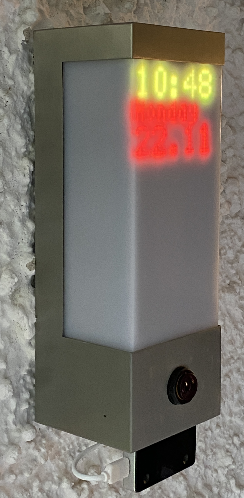
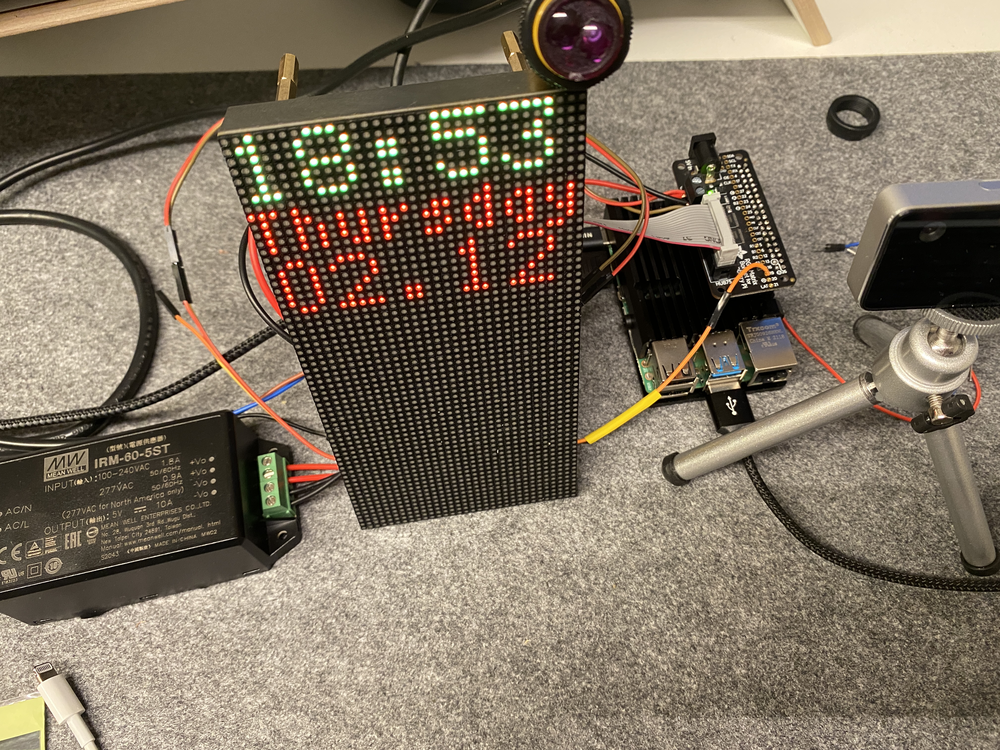
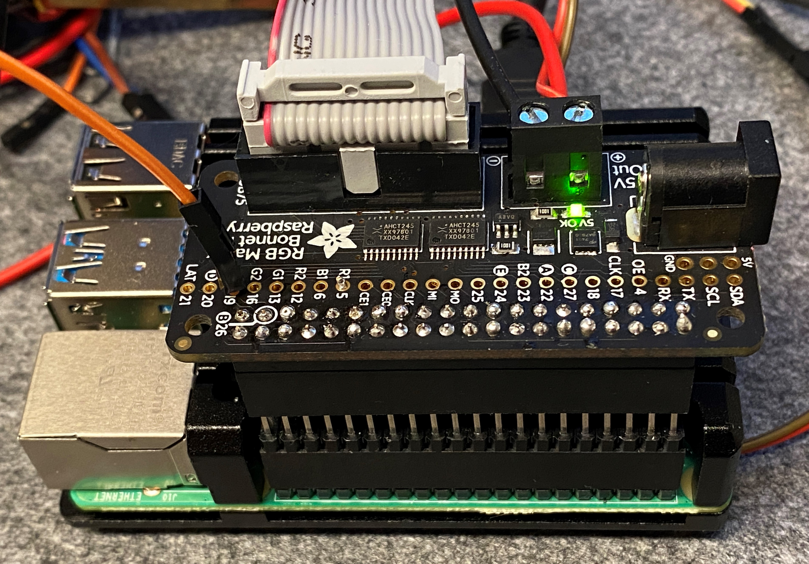
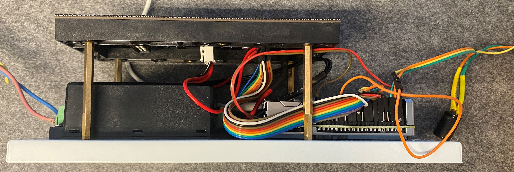
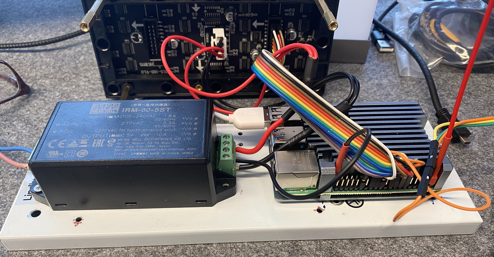
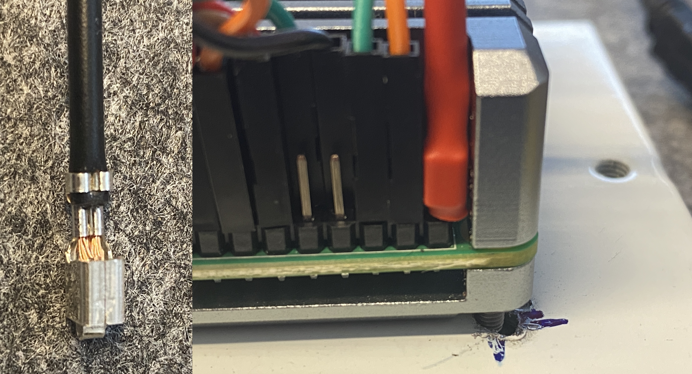
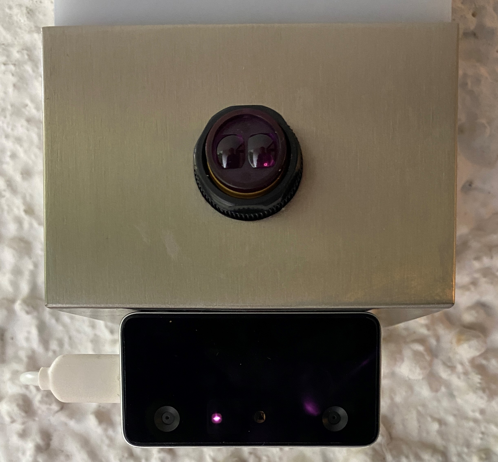
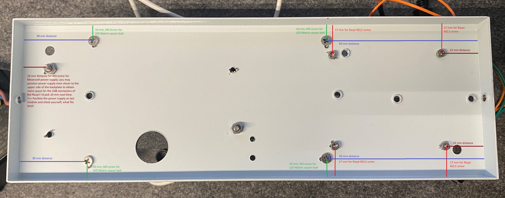
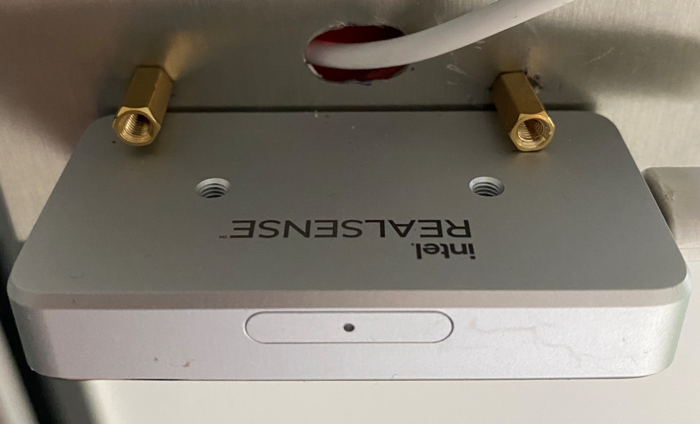
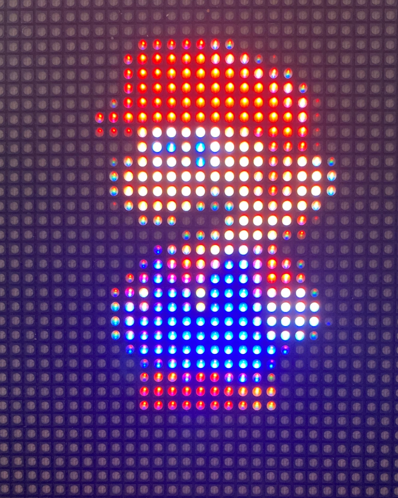

<p align="right">
  <a href="./README.md" rel="noopener">ENGLISH VERSION</a>
<p align="center">
  <a href="" rel="noopener">
 </a>
</p>

<h3 align="center">smartdoorF455</h3>

<div align="center">


[](/LICENSE)

</div>

---

<p align="center">Mit der Einführung des iPhone X im September 2017 hat Apple die Authentifizierung mit biometrischen Gesichtsmerkmalen als zuverlässige Technologie in unseren Alltag eingeführt. Mit diesem Projekt möchten wir dieses Verfahren als Türöffner vom Smartphone ins Smarthome bringen.  
    <br> 
</p>

## 📝 Table of Contents

- [Einführung](#about)
- [Vorüberlegungen](#getting_started)
- [benötigte Hardware](#prerequs)
- [Funktionsweise](#functionality)
- [Hardware Aufbau](#hardware_setup)
- [Verkabelung](#wiring)
- [Präsenzsensor](#presence_sensor)
- [Gehäuseinstallation](#case_installation)
- [Software Installation](#install)
- [Programmstart](#usage)
- [Gesichter für die Authentifizierung anlernen](#teach_faces)
- [Sourcecode Anpassung](#sourcecode_adaption)
- [Sesam öffne Dich!](#open_sesame)
- [Kamerasicherheit](#camera_security)
- [End of Life der Intel ReaSenseID F455 Kamera](#end_of_life)
- [Troubleshooting](#troubleshooting)
- [Änderungen und Erweiterungen](#changes_enhancements)
- [Fazit](#conclusion)
- [Video](#video)
- [Entwickelt auf Basis von ...](#built_using)
- [Autor](#author)
- [Dank gebührt ...](#acknowledgement)

## 🧐 Einführung <a name = "about"></a>

Anfang 2021 griff Intel mit der Ankündigung der RealSense ID F455 Kamera dieses Prinzip auf und bietet Makern ein interessantes Produkt für die Integration in Eigenbaulösungen an. Die Kamera kann mit umfangreicher Dokumentation, einem quelloffenen SDK für Linux, Windows und Android sowie den Sprachen C, C++, C# und Python punkten. Sie lässt im Gegensatz zu Apple die Authentifizierung mehrerer Personen zu, deren Profile entweder zentral auf einem Server oder in einer Datenbank der Kamera selbst abgelegt werden. Die „False Acceptance Rate“ – also die Zahl der fälschlicherweise zugelassenen Personen - gibt Intel ebenso wie Apple mit 1:1 Million an. Der gesamte Authentifizierungsprozess der Kamera dauert dabei weniger als eine Sekunde. Die RealSense ID F455 ist damit der perfekte Kandidat, um unsere Haustüre per 3D-Gesichtserkennung mit geringer Fehlerrate und in kurzer Zeit öffnen zu lassen. 

<a href="" rel="noopener">
 </a>

## 🏁 Vorüberlegungen <a name = "getting_started"></a>

Wenn Sie darüber nachdenken, den intelligenten Türöffner mit 3D-Gesichtsauthentifizierung nachzubauen, richten Sie bitte zuerst Ihr Augenmerk auf eine IP-Schnittstelle zum Türöffner. Dies ist der kritische Teil für einen möglichen Nachbau dieser Anwendung und kann Ihrerseits Kreativität erfordern, da die Anforderungen von Tür zu Tür sehr unterschiedlich sind. Wir haben für dieses Projekt einen busbasierten Türöffner der Marke Siedle vorgefunden. Je nach Türsprechanlage und IP-Gateway muss der Code entsprechend angepasst werden. Wir haben dies im Code mit „TRIGGER DOOR OPENER START“ und „TRIGGER DOOR OPENER END“ gekennzeichnet. Wenn Sie kein MQTT für die Kommunikation zum Öffnen der Tür verwenden, können Sie die Zeile #define MOSQUITTO_IN_USE auskommentieren oder die Zeilen, die diesen #ifdefs eingeschlossen sind, entfernen oder anpassen.

## 🔨 benötigte Hardware <a name = "prerequs"></a>

Die Hardwarekosten belaufen sich auf rund 500 EUR zzgl. IP Schnittstelle für die Türsprechanlage.  

- Intel RealSense ID F455 Kamera
- Raspberry PI 4B, >= 4 GB RAM mit Raspberry Pi OS 
- Micro SD card >= 16 GB
- 5V Stromversorgung e.g. Meanwell IRM-60-5ST 5V 10A 
- Als Gehäuse nutzen wir die Außenleuchte mit PIR Sensor "Severina by Lindby" 
- RGB LED 64x32 P2,5 Matrix mit 160x80 mm Abmessung z.B. Adafruit 5036 
- E18-D80NK IR Reflexlichtschranke
- 10 kΩ pull-up Widerstand
- 40 pin GPIO Flachbandkabel oder 20x female/female Jumperkabel
- 4x 40mm, 4x15mm, 2x 10mm M3 Distanzbolzen aus Messing für die Montage der LED Matrix
- 8x M3 Mutter zur Befestigung der Distanzbolzen an der Gehäuserückwand
- 4x M2,5 12mm Schrauben zur Befestigung des Raspis am an der Gehäuserückwand
- ¼ Zoll Schraube zur Befestigung der Kamera auf der Unterseite des Gehäuses
- Kabeldurchführungstülle für das USB Kabel an der Unterseite des Gehäuses
- Schrumpfschlauch zur Isolation der Niedervoltstromklemme
- eine IP-basierte Schnittstelle für den Haustür Buzzer z.B. ein Siedle Gateway
- Optional: Geeek Pi Raspberry Pi 4 Armor Case
- Optional: Adafruit RGB Matrix Bonnet mit 40 Pin Pitch Stacking Header – um den Abstand des Matrix Bonnet zum Board zu vergrößern, damit es über das Armor Case ragt
- Optional: PIR Sensor HC-SR 501 als alternativen Präsenzmelder und Ersatz für die E18-D80NK Reflexionslichtschranke

## Funktionsweise <a name = "functionality"></a>
Der smarte Türöffner hat die in die Jahre gekommene Eingangsbeleuchtung ersetzt und wurde daher in das Gehäuse einer solchen untergebracht. Das System wird lediglich über eine Netzspannung versorgt und kommuniziert über das hauseigene WLAN. Es ist also sicherzustellen, dass der Ort der Einlasskontrolle über entsprechenden Empfang  verfügt. 



*smarter Türöffner im Gewand einer Außenleuchte*

Da die Kamera selbst nicht über einen Präsenzmelder verfügt, wird diese von einer Infrarot-Reflexlichtschranke getriggert. Die um Einlass bittende Person wischt mit der Hand kurz an der Lichtschranke vorbei oder kommt mit dem Gesicht kurz etwas näher heran. Ein schwaches, rotes Leuchten durch den Infrarot Illuminator der unten am Gehäuse kopfüberstehend angebrachten Kamera ist kurz zu sehen.  Die Kamera projiziert nun für Menschen unsichtbare Infrarotpunkte mit einer Wellenlänge von 850 nm ins Gesicht, nimmt diese mit zwei seitlich integrierten Full HD Kameras auf und bildet daraus eine dreidimensionale Punktewolke, die sie via KI Inferenz mit den gespeicherten Gesichtsprofilen vergleicht. Für diesen Authentifizierungsprozess benötigt die Kamera weniger als eine Sekunde und überträgt das Ergebnis - im positiven Fall den Namen der erkannten Person - per USB Kabel an den Raspberry Pi Computer. Da wir nur eine Kamera nutzen, sind diese Profile lokal auf der Kamera abgelegt. Für die Authentifizierung mit mehreren Zugängen bietet die Kamera einen Server Modus, bei dem die Zugangsprofile auf einem zentralen Server abgelegt werden und so von mehreren Kameras genutzt werden können. Bei positiver Authentifizierung wird der Name der erkannten Person für einige Sekunden auf dem LED Matrix Display angezeigt und die Tür per MQTT Kommando via WLAN geöffnet. Im Ruhezustand zeigt das LED Matrix Panel die Uhrzeit, den Wochentag und das aktuelle Datum an. 
Eine Demonstration der Funktionsweise per Youtube Video finden Sie hier:

[](https://www.youtube.com/watch?v=hRnp7CBBR0Q)

*Youtube - Funktionsweise des smarten Türöffners mit 3D-Gesichtserkennung*

## Hardware Aufbau <a name = "hardware_setup"></a>
Als Host Computer kommt ein Raspberry 4B mit Raspberry PI OS aka Raspian zum Einsatz. Als Gehäuse haben wir uns für eine Außenleuchte im Edelstahlgehäuse entschieden, welche vor der Haustür angebracht ein unscheinbares Bild abgibt. Darin befinden sich neben dem Raspi ein 5V Netzteil mit 50 Watt Leistung, eine Reflexionslichtschranke und ein Adafruit 5036 LED Matrix Display mit einer Auflösung von 64x32 RGB Leds. Dieses wird über 4 Distanzbolzen mit einer je addierten Länge von 55 mm (40 mm + 15 mm) auf die Grundplatte des Gehäuses aufgebracht. Das Matrix Modul hat eine Dicke von 15 mm, so dass sich ein Abstand von 70mm zwischen Grundplatte und dem satinierten Acrylglas ergibt. Damit die LED Matrix Inhalte durch die Satinierung nicht zu sehr verschwimmen, ist es wichtig, dass das LED Matrix Modul direkt am Acrylglas anliegt. 
Bevor der Aufbau in das ausgeschlachtete Lampengehäuse integriert wird, verkabelt man die Bauteile prototypisch und testet die Funktionalität der Einzelkomponenten und des Systems.


*erster Test im prototypischen Aufbau*

## Verkabelung <a name = "wiring"></a>
Für den Anschluß des RGB Matrix Displays an den Raspberry PI bieten sich 2 Möglichkeiten: 
1. Adafruit RGB Matrix Hat/Bonnet:
Dieses Aufsteckboard bietet eine aufgeräumte Verkabelung über den HUB75 Steckverbinder, welcher im Lieferumfang des LED Matrixmoduls enthalten ist. Damit sich das Aufsteckboard mit dem Raspi Armor Case nicht in die Quere kommt, ist dieses über einen 40 Pin Pitch Stacking Header zu erhöhen. Dadurch entsteht der Nachteil einer höheren Bauform von ca. 6 cm. Da der Raspi im unteren Teil des Gehäuses dem Sensor gegenüber eingebaut wird, ist dies für die Verwendung des PIR Sensors HC-SR 501 OK,  führt jedoch bei Verwendung der  E18-D80NK IR Lichtschranke mit einer Gehäuselänge von 5,5 cm zur Kollision beim Zusammenbau des Lampengehäuses. Daher empfehlen wir bei Verwendung der E18-D80NK Lichtschranke entweder die nachfolgend dargestellte diskrete Verkabelung oder den Platztausch – Netzteil im unteren, Raspi im oberen Gehäuseteil!
Die Stromversorgung des Raspis erfolgt über den Klinkenstecker oder die Schraubklemmen am am Adafruit Bonnet. Zudem nutzt das Adafruit Bonnet andere [GPIO](https://www.heise.de/tipps-tricks/Raspberry-Pi-Das-koennen-die-GPIO-Pins-4583823.html) Ports für die Kommunikation, so daß wir in Adafruit Bonnet Fall GPIO 19 für den Präsenzsensor nutzen. Ein Jumper Kabel für den Sensor Ausgang ist daher auf das Bonnet zu löten.


*Verkabelung mit Adafruit Matrix Bonnet auf Pitch Stacking Header über dem Armor Case mit Jumper Kabel an GPIO19 verlötet*

2. Diskrete Verkabelung mit 40-Pin GPIO Flachbandkabel oder Buchse/Buchse Jumperkabel <a name = "Diskrete_Verkabelung"></a>



*diskrete Verkabelung, LED Matrix mit 55mm Distanzbolzen umschlingen Raspi und Netzteil*



*diskrete Verkabelung mit Jumperkabel*

Etwas fummeliger aber genauso funktional gestaltet sich die diskrete Verkabelung mittels Jumper- oder Flachbandkabel. Der Präsenzsensor (PIR oder Lichtschranke) wird bei der diskreten Verkabelung über [GPIO Pin 5](https://www.heise.de/tipps-tricks/Raspberry-Pi-Das-koennen-die-GPIO-Pins-4583823.html) verschalten. Das Meanwell Netzteil verfügt am Niederspannungsausgang über eine 4-polige Schraubklemme, über die sowohl die RGB Matrix über die im Lieferumfang enthaltene Powerkabel als auch der Raspi über GPIO Pin 2 für 5V und GPIO Pin 39 für GND mit Strom versorgt werden. Für die Stromversorgung des Raspis empfehlen wir nicht die Jumperkabel, sondern einen größeren Kabelquerschnitt und bissigere Klemmen zu verwenden. Wir haben hierzu 2 redundante Kabelklemmen aus der Stromversorgung LED Matrix zweckentfremdet, mit einem kleinen Schraubendreher herausgezogen und mit einem Schrumpfschlauch überzogen, damit keine Kurzschlussgefahr am GPIO Pin 2 droht. 



*Umwidmung zweier 5V Power Kabel vom LED Matrixmodul zur Mitversorgung des Raspis*

Die Anleitung für die diskrete Verkabelung des LED Matrixmoduls ist ausführlich hier dargestellt:
[https://github.com/hzeller/rpi-rgb-led-matrix/blob/master/wiring.md](https://github.com/hzeller/rpi-rgb-led-matrix/blob/master/wiring.md)



*Kamera kopfüber an der Unterseite des Gehäuses*

Die Kamera wird kopfstehend an der Unterseite des Gehäuses angebracht. Ein USB-C Kabel, welches sich im Lieferumfang der Kamera befindet, wird durch ein zu bohrendes Loch hinter der Kamera in das Gehäuse geführt und in einen der 4 USB-A Anschlüsse des Raspberry Pi gesteckt. 

## Präsenzsensor <a name = "presence_sensor"></a>
Das frontale Gehäuseloch, welches für die Linse des PIR Sensors vorbehalten war, ist mit der Reflex-Infrarotlichtschranke befüllt, indem diese von den beiden beiliegenden Kunstoffmuttern innen- und außenseitig verschraubt ist. Der Sensor wird über das Matrix Bonnet mit einer Spannung von 5V versorgt. Das braune Kabel wird dabei in die mit  "5V Out" beschriftete Klemme geführt - sofern das Adafruit Matrix Bonnet zum Einsatz kommt. 

Bei diskreter Verkabelung gibt es mehrere Möglichkeiten die Spannung von 5V am [GPIO](https://www.heise.de/tipps-tricks/Raspberry-Pi-Das-koennen-die-GPIO-Pins-4583823.html) Pins abzugreifen: Z.B. +5V an Pin 4 und GND - blaues Kabel - an Pin 34. Der Sensor Ausgang - schwarzes Kabel - wird mit Pin 29 bzw. logisch GPIO Port 5 verbunden. 

Wer keine gegenüberliegende Wand oder eine ähnliches Infrarotlicht reflektierendes Objekt hat, kann statt der Lichtschranke einen PIR Sensor z.B. den HC-SR 501 verwenden. In unserem Falle hat dieser viele falsch positive Bewegungen registriert und damit die Kamera häufig getriggert, da das LED Matrix Modul für das menschliche Auge unsichtbar flackert und durch eine gegenüberliegenden Wand den PIR Sensor irritierte. 

## Gehäuseinstallation <a name = "case_installation"></a>
Das Gehäuse der Sensor-Außenwandleuchte Severina von Lindby ist wie geschaffen für die RGB LED Matrix mit den Maßen von 160 mm x 80 mm und bietet gerade Platz für alle Komponenten. Für die Montage derselben sind einige Löcher in das Rückwandblech zu bohren. 



*Rückwandblech mit zusätzlichen Bohrlöchern*

Die Kamera ist vom Gehäuseinnern mit einer ¼ Zoll Schraube am unteren Edelstahlblech festgeschraubt. Um ein einfaches Abdrehen der wertvollen Kamera zu verhindern, ist diese mit zwei Distanzbolzen von 10 mm Länge gesichert. 



*Distanzbolzen als Diebstahlsicherung und noch fehlender Kabeldurchlasstülle 😮*


## 💾 Software Installation <a name = "install"></a>

Das Programm „smartdoorF455“ ist in C und C++ verfügbar und sollte der Konfiguration entsprechend angepasst werden. Je nachdem, ob Sie das Adafruit Matrix Bonnet zum Anschluss der LED-Matrix verwenden, ob die Intel RealSenseID-Kamera kopfüber montiert ist oder ob Sie einen PIR-Sensor – mit einem Low-to-High-Übergang zur Anwesenheitsanzeige – oder eine Infrarot-Lichtschranke verwenden - mit einem High-to-Low-Übergang für die Anwesenheitsanzeige, um die Authentifizierung über die Kamera auszulösen: Dies muss im markierten Abschnitt SYSTEMKONFIGURATION des Codes konfiguriert werden.

So kompilieren Sie den Code unter der Annahme eines jungfräulich installierten Raspberry Pi-Betriebssystems:
```
# installation of smartdoorF455
# bring Raspi up2date and get additional software developement tools
sudo apt-get update
sudo apt-get upgrade
sudo apt-get install cmake build-essential -y
sudo apt-get install mosquitto mosquitto-dev libmosquittopp-dev -y
sudo apt-get install libgraphicsmagick++-dev libwebp-dev -y 
# make sure pigpio is installed, see
# https://abyz.me.uk/rpi/pigpio/download.html
sudo apt-get install pigpio -y
# install RealSense ID SDK by Intel
git clone https://github.com/IntelRealSense/RealSenseID.git
cd RealSenseID
mkdir build
cd build
cmake .. -DRSID_PREVIEW=1
make -j4
# install rpi-rgb-led-matrix by Henner Zeller
git clone https://github.com/hzeller/rpi-rgb-led-matrix.git
cd rpi-rgb-led-matrix/
make -C examples-api-use
# smartdoorF455
git clone https://github.com/joergwall/smartdoorF455.git
cd smartdoorF455
mkdir build
cd build
cmake ..
make -j4
```


## 🎈 Programmstart <a name="usage"></a>

Das kompilierte C++ Programm „smartdoorF455“ bzw. C-Programm „smartdoorF455_c“ sollten sich nun im Verzeichnis ~/smartdoorF455/bin befinden. Die Quellcodes finden sich in ~/smartdoorF455/cpp bzw. ~/smartdoorF455/c. Das Programm wird per Shell Script mit sudo gestartet: 

```
cd ~/smartdoorF455/bin
sudo ./run_smartdoorF455.sh 
```
or who prefers the variant in programming language C:
```
sudo ./run_smartdoorF455_c.sh 
```

and provides the following output depending on the user name and time/date:
```
/home/pi/log created
smartdoorF455 started successfully
watch /home/pi/log/20211216_092446_smartdoorF455.log for errors
```

Even if the camera has not yet rehearsed a face, the time, the day of the week and the date should now be visible. If this is not the case, please go to the chapter [Troubleshooting](#Troubleshooting). To abort the program, please use the martial command:
```
sudo killall smartdoorF455
```

## Gesichter für die Authentifizierung anlernen <a name = "teach_faces"></a>
Um das Antlitz der berechtigten Nutzer in die Kamera zu bringen, nutzen wir ein Werkzeug mit Kommandozeilen Schnittstelle. Sollte das Device /dev/ttyACM0 fehlen, nimmt man stattdessen /dev/ttyACM1. Nun erscheinen die aktuell in der Kamera hinterlegten Parameter und ein Auswahlmenü. Der Parameter Rotation kann im Menü „s“ abhängig von aufrechter Kamerapositionierung auf 0 oder kopfüber auf 180 gesetzt werden - also je nach dem ob die Kamera kopfüber unten am Gehäuse oder aufrecht z.B. auf dem mitgelierten Ministativ angeschraubt ist. Der Menüpunkt „e“ bietet das Anlernen mit lokaler Profilspeicherung auf der Kamera an. Dabei sollte das Gesicht ca. 30 bis 50 cm von der Kamera entfernt sein.  Die Prozedur sieht dann wie folgt aus: 
```
# enroll user for authentication
cd ~/RealsenseID/build/bin
sudo ./rsid-cli /dev/ttyACM0
Connected to device

Authentication settings::
 * Rotation: 0 Degrees
 * Security: High
 * Algo flow Mode: All
 * Face policy : Single
 * Dump Mode: CroppedFace
 * Matcher Confidence Level : High
Please select an option:

  'e' to enroll.
  'a' to authenticate.
  'd' to delete all users.
  'c' to capture images from device.
  's' to set authentication settings.
  'g' to query authentication settings.
  'u' to query ids of users.
  'n' to query number of users.
  'b' to save device's database before standby.
  'v' to view additional information.
  'x' to ping the device.
  'q' to quit.
  
server mode options:
  'E' to enroll with faceprints.
  'A' to authenticate with faceprints.
  'U' to list enrolled users
  'D' to delete all users.
> e
User id to enroll: Julia
Connected to device
  *** Hint Success
  *** Hint Success
```
Auf diese Weise werden die Gesichtsprofile aller berechtigten Personen angelernt. Bei der Namensvergabe ist darauf zu achten, dass das RGB LED Matrixmodul nur eine geringe Zahl an Buchstaben darstellen kann. Bei dem von uns verwendeten Font sind dies lediglich 5 Zeichen. Bitte nutzen Sie hierfür ggf. Namenskürzel oder stellen Sie im Sourcecode Zeile 99 den BDF Font für das Namenskürzel kleiner, damit können dann bis zu 8 Zeichen in einer Zeile dargestellt werden:
```
#define FONT_NAME FONT_PATH "4x6.bdf"
```

## Sourcecode Anpassung <a name = "sourcecode_adaption"></a>
Der Quellcode unter ~/smartdoorF455/cpp bzw. ~/smartdoorF455/c muss an die Gegebenheiten angepasst werden. Kommt MQTT zum Einsatz oder wird ein Adafruit Bonnet für die Verkabelung des LED RGB Matrixmoduls verwendet? Dies ist im Quellcode durch entsprechende #define Konstanten Definitionen anzupassen. Wird z.B. der Adafruit Bonnet genutzt, wird GPIO 19 anstelle GPIO 5 für die Infrarot-Reflexlichtschranke verwendet, da die Ansteuerung der RGB Matrix über andere GPIO Pins erfolgt: 
```
/* START SYSTEM CONFIGURATION SECTION */
#define MOSQUITTO_IN_USE /* comment this line, if MQTT is not used to open door */
#define ADAFRUIT_BONNET_IN_USE /* comment this line, if you have direct cable wiring from Raspi to LED Matrix */
#define STDOUT_ADDTL_INFO  /* provides additional information on stdout e.g. prints date/time when movement sensor triggers camera */
/* END   SYSTEM CONFIGURATION SECTION */
```

## Sesam öffne Dich!<a name = "open_sesame"></a>
Um die Haustüre mit der hier vorgestellten Lösung entriegeln zu können, muss die Türsprechanlage eine IP Schnittstelle bereitstellen. Wer einen Nachbau dieses Projekts in Angriff nehmen möchte, sollte zunächst eingehend den Ist-Zustand der Klingelanlage analysieren und sich über Möglichkeiten einer Erweiterung um eine IP Schnittstelle bemühen. 

Wir haben eine Siedle Bus-basierte Türsprechanlage vorgefunden und ein Gateway von Oskar Neumann im Einsatz, welches per WLAN MQTT Kommandos in den Siedle Bus übersetzt jedoch aktuell nicht mehr am Markt angeboten wird. Siedle bietet als IP Schnittstelle das Smart Gateway SG-150 an, welches jedoch mit mehr als 600,- € für Selbstbau Projekte einen ordentlichen Brocken darstellt. Weitere von uns nicht geprüfte Alternativen für eine Siedle IP Schnittstelle sind Fremdhersteller Gateways wie z.B. von der [Firma Hamares](http://hamares.de/?Tuersprechadapter_TM_lll_ab_light) oder der smarte Türöffner von [SMS Guard](https://www.sms-guard.org/downloads/smarter-Tueroeffner-Anleitung.pdf), welcher ebenso eine MQTT Schnittstelle bereitstellt. 
Zur Vertiefung dieser Thematik seien noch die Artikel [Fritzbox öffnet die Tür](https://www.heise.de/select/make/2020/5/2020407154013533990) von Hans Borngräber und [Smarte Türöffner im Test: Türklingeln mit Kamera und App für mehr Sicherheit](https://www.heise.de/tests/Smarte-Tueroeffner-im-Test-Tuerklingeln-mit-Kamera-und-App-fuer-mehr-Sicherheit-6123623.html) von Sven Hansen erwähnt.

Wer bereits eine IP-basierte Türsprechanlage im Einsatz hat, ist aus dem Schneider und kann im Quellcode zwischen den mit "TRIGGER DOOR OPENER START" und "TRIGGER DOOR OPENER END" gekennzeichneten C/C++ Code anpassen um den Türöffner zu triggern. Ist dieser Trigger z.B. ein http-Request, kann dieser per Linux System Call in der ~/smartdoorF455/c/main.c bzw. ~/smartdoorF455/cpp/main.cpp Datei eingefügt werden:
```
/* TRIGGER DOOR OPENER START - ADAPT THIS CODE according to your interface to 
   your door buzzer */
/* exemplary adaptation of the C/C++ code */
/* Assumption: the door opener can be opened with the http request */
/* -------  http://192.168.178.27:8083/fhem?cmd=set%20Siedle%20open  */
/* Make sure the curl module is installed in Raspian: */
/* sudo apt install curl */
/* Since no MQTT protocol is used for the door opener */
/* remove those enclosed between "#ifdef MOSQUITTO_IN_USE" and "#endif" */
/* lines. */

system("curl http://192.168.178.27:8083/fhem?cmd=set%20Siedle%20open");

/* TRIGGER DOOR OPENER END */
```

## Mosquitto MQTT Broker <a name = "mqtt"></a>

Kommt MQTT für die Kommunikation mit dem Türöffner zum Einsatz, ist für die Konfiguration des MQTT Brokers auf dem Raspi folgende Konfigurationsdatei zu erstellen:
```
sudo nano /etc/mosquitto/conf.d/mymosquitto.conf
# add following lines 
listener 1883
listener 1884
allow_anonymous true
```
Danach wird der Broker neugestartet:
```
sudo systemctl restart mosquitto
```
Ein mosquitto client lässt uns zu Debugging-Zwecken mitlauschen, was an Informationen über den Broker ausgetauscht wird:
```
mosquitto_sub -d -t "#"
```
In [c't 6/2018 page 164](https://www.heise.de/select/ct/2018/6/1520740468882312) (German Source) Jan Mahn explains in detail how MQTT works. In particular, the protection of MQTT via encryption is shown there, which we have omitted here for reasons of complexity. The solution presented here is therefore as secure or insecure as the domestic WIFI. This reading is recommended for all makers if they decide to use MQTT as a protocol.

## Kamerasicherheit <a name = "camera_security"></a>

Intel bietet im RealSense ID SDK einen Secure Communication Mode an. Dieser Modus ermöglicht ein Pairing von Kamera mit dem Host System und eine verschlüsselte Kommunikation. Dadurch wird die Möglichkeit ausgeschlossen, dass sich ungebetene Gäste über eine weitere RealSense ID Kamera - mal schnell per USB-C an gestöpselt - mit anderen Gesichtsprofilen unerlaubt Zugang verschaffen. Aus Komplexitätsgründen haben wir diesen Modus hier nicht verwendet. Maker finden die entsprechende Anleitung, diesen Modus zu aktivieren hier:

https://github.com/IntelRealSense/RealSenseID#secure-communication

## Dokumentation
Neben dem Blick in den Quellcode lohnt sich eine Vertiefung der Dokumentation von den verwendeten Bibliotheken

[https://github.com/IntelRealSense/RealSenseID](https://github.com/IntelRealSense/RealSenseID)

[https://github.com/hzeller/rpi-rgb-led-matrix](https://github.com/hzeller/rpi-rgb-led-matrix)

und der diesem zugrunde liegenden Projekt:

[https://github.com/joergwall/smartdoorF455](https://github.com/joergwall/smartdoorF455)

Das Datenblatt der [Intel RealSense ID F455](https://www.intelrealsense.com/download/14251/?_ga=2.193882917.902480494.1639564247-1894839341.1630402409) Kamera ist einen Blick wert. Eine gute Beschreibung der [E18-D80NK IR Reflexionslichtschranke](https://www.roboter-bausatz.de/media/pdf/44/55/49/RBS10158-Manual_IR-Sensor-Switch-E18.pdf) haben wir im [Roboter-Bausatz.de](https://www.roboter-bausatz.de/p/e18-d80nk-infrarot-hinderniserkennung) Online Shop vorgefunden. Insbesondere die Einstellung der Detektionsentfernung und die Verwendung des Pull-Up Widerstands wird hier näher erläutert. Informationen zu deren Alternative mit dem PIR Sensor HC-SR 501 sind ebenfalls [dort](https://www.roboter-bausatz.de/p/hc-sr501-pir-infrarot-sensor-modul) erhältlich.

## Optimierung <a name = "optimization"></a>
Um einen der vier Prozessorkerne aus der Obhut des Prozess Schedulers zu entnehmen, um diesen unserer Anwendung zur ausschließlichen Nutzung zu überlassen, ist folgende Datei anzupassen:
```
sudo nano /boot/cmdline.txt
```
„isolcpus=3“ am Zeilenende der Datei anhängen, so dass diese in etwa so aussieht:
```
console=serial0,115200 console=tty1 root=PARTUUID=e0d8ecc0-02 rootfstype=ext4 fsck.repair=yes rootwait quiet splash plymouth.ignore-serial-consoles isolcpus=3
```
Dieser Schritt wird nach dem Neustart des Rechners wirksam und soll ein etwaiges Flackern des LED Matrix Displays verhindern. Die Zuordnung der Prozessoraffinität unseres Programms auf die freigestellte CPU wird am Ende des Start Scripts run_smartdoor_F455.sh mit dem Kommando taskset vollzogen.

## End of Life der Intel RealSenseID F455 Kamera <a name = "end_of_life"></a>
Obwohl Intel die RealSense ID Produktlinie als Lösung für die biometrische Authentifizierung per Gesicht erst im Januar 2021 ankündigte, wurde diese bereits im September 2021 mit Wirkung zum 28. Februar 2022 abgekündigt. Eine Alternative, welche den dreidimensionalen Scan mit einer künstlichen Intelligenz für die Gesichtserkennung kombiniert, ist uns aktuell nicht bekannt. Wer eine solche Kamera ergattern will, muss sich also beeilen um noch einen Restposten bei den Händlern zu finden. Diese Intel Webseite weist auf diesen Umstand hin:
[https://www.intelrealsense.com/facial-authentication/](https://www.intelrealsense.com/facial-authentication/)

## Troubleshooting <a name = "Troubleshooting"></a>
Beim Nachbau dieses Smarthome Türöffners bestehend aus Trafo, LED Matrix, Raspi und ggf. Matrix Bonnet können hie und da schon mal Problemchen auftreten, von denen wir hier die uns bekannten adressieren möchten. Zunächst zu Hardware Themen:
- Spannungsversorgung

Der Raspi reagiert empfindlich, wenn die Spannungsversorgung unter den kritischen Wert von 4,63 V abfällt. Die rote LED fängt an zu blinken oder wird ganz dunkel. Der Meanwell Trafo liefert zwar eine stabile Spannung, wie jedoch im [Kapitel Verkabelung](#Verkabelung) dargestellt, sollte bei der Stromversorgung auf ausreichenden Kabelquerschnitt und griffige Klemmen geachtet werden. Im Zweifel sollte man die Spannung an den GPIO Pins 2/4 und 6 mit einem Multimeter nachmessen und ggf. für Verstärkung z.B. durch ein weiteres Kabel sorgen.
- Verzerrtes Bild auf dem LED Matrix Display

Wird das LED Matrix Bonnet eingesetzt und über einen 40 Pin Pitch Stacking Header erhöht, sind uns wackelige Kandidaten bekannt. Insbesondere ein Pitch Stacking Header, welches dem Armor Case beilag, hat uns Probleme bereitet. Einschlägige Elektronik-Versandhändler bieten Pitch Stacking Header mit vergoldeten Kontakten für schlankes Geld, die für uns gute Dienste geleistet haben.


Auch die Software zickt gelegentlich. Zunächst prüfen wir das aktuelle Logfile auf aufschlussreiche Fehlermeldungen. Gehen Sie dazu in das log Verzeichnis, suchen Sie nach der jüngsten Logdatei und geben Sie diese wie folgt aus:
```
cd ~/log
ls -la
more ./20211216_092446_smartdoorF455.log
```

- „Couldn't load fontfiles“

Um diesen Fehler zu eliminieren, ist die Konstante FONT_PATH im C und C++ Code auf den absoluten Pfad anzupassen, in dem die bdf Fonts zu finden sind.  In Abhängigkeit vom verwendeten User-Namen ist dies z.B: „/home/pi/pi-rgb-led-matrix/fonts/“.
Korrigieren Sie entsprechende Zeile im Source Code in ~/smartdoorF455/cpp/main.cpp und ~/smartdoorF455/c/main.c und kompilieren Sie neu, indem Sie im build Verzeichnis das Kommando make starten:
```
cd ~/smartdoorF455/build
make
```

- "on_result: Error"

Wir fuchteln mit der Hand vor dem Präsenzsensor, aber das schwache, rote Aufleuchten des Infrarot Illuminators der Kamera bleibt aus - die Kamera will den Authentifizierungsprozess einfach nicht einleiten.
Nach einem Neustart des Raspberry Pi Rechners kommt es gelegentlich vor, dass sich die Kamera beim ersten Start der Applikation nicht korrekt initialisiert. Beenden Sie das Programm, Starten Sie es erneut:
```
sudo killall smartdoorF455
cd ~/smartdoorF455/bin
sudo ./run_smartdoorF455.sh 
```

- "initInitialise: Can't lock /var/run/pigpio.pid cannot initialize GPIO"

Läuft ein anderes Prozess, welcher den GPIO blockiert? Auch bei dieser Fehlermeldung hilft ein Neustart des Programms, wie oben dargestellt.

- LED Matrix Display bleibt dunkel

Keine Fehlermeldung im Logfile, das LED Matrixmodul ist [korrekt verkabelt](https://github.com/hzeller/rpi-rgb-led-matrix/blob/master/wiring.md), aber das Display bleibt trotzdem dunkel? Dann könnte das falsche Setzen der ADAFRUIT_BONNET_IN_USE Konstante die Ursache sein. Kommentieren Sie diese bei [diskreter Verkabelung](#Diskrete_Verkabelung) im C und C++ Code wie folgt aus:
```
/* #define ADAFRUIT_BONNET_IN_USE */
```
und kompilieren Sie neu (siehe oben).


Wenn die Software einmal läuft und den Ihr zugedachten Service erbringt, ist das System nach unserer Erfahrung über viele Tage und Wochen stabil. Selbst Großmutter läßt Ihren Schlüssel mittlerweile zuhause und verlässt sich auf Einlass per Gesichtskontrolle.

## Änderungen und Erweiterungen <a name = "changes_enhancements"></a>
- Verzicht auf RGB Matrixmodul

Alternativ sind andere, einfachere Aufbauten in anderen Gehäusen möglich: Wer beim Nachbau auf das RGB LED Matrixmodul verzichten möchte, kann z.B. eine mehrfarbige RGB Leuchtdiode verwenden um den Authentifizierungsstatus darzustellen. Dadurch entfällt die Notwendigkeit für den leistungsstarken 5V / 10 A Trafo und es kommt die übliche USB-C Stromversorgung des Raspi zum Einsatz. Das Projekt lässt sich dadurch wesentlich verschlanken und kann in kleineren Gehäuseabmaßen untergebracht werden.
- Ubuntu anstelle Raspberry Pi OS

Raspberry Pi OS ist sehr robust und nutzt die Hardware optimal, jedoch wird das RealSense ID SDK von Intel nur eingeschränkt darauf unterstützt. Alternativ zu Raspian haben wir Ubuntu Linux 20.4 erfolgreich getestet. Ubuntu wird interessant, wenn erweiterte Funktionen der RealSense ID Software genutzt werden sollen wie z.B. der Zugriff auf Screenshots der Kamera um diese per Telegram Messenger via Bot zu versenden. Wer diesen Weg beschreiten und sich tiefer in die RealSense ID SDK einarbeiten möchte, dem empfehlen wir eine separate SD Karte für diesen Unterfangen mit Ubuntu Linux zu flashen.
- Pixelart zum Aufheitern der Nachbarn 

Wer lustige Animationen auf dem LED Matrix Display abspielen möchte, dem seien die Beispielprogramme unter ~/rpi-rgb-led-matrix/utils ans Herz gelegt. Hier kann man z.B. gif Animationen mit folgenden Befehlszeilen auf das LED Matrix Display zaubern:
```
# spinning Super Mario 
cd ~/rpi-rgb-led-matrix/utils/
make
wget https://media1.giphy.com/media/QxZEtFE02ofY00gJ71/giphy.gif 
sudo ./led-image-viewer --led-rows=32 --led-cols=64 --led-brightness=90 --led-pixel-mapper "Rotate:270" --led-rgb-sequence=RBG --led-no-hardware-pulse ./giphy.gif
```
bzw. Bei Verkabelung mit dem Adafruit RGB LED Matrix Bonnet
```
sudo ./led-image-viewer --led-rows=32 --led-cols=64 --led-brightness=90 --led-pixel-mapper Rotate:270 --led-rgb-sequence=RBG --led-gpio-mapping=adafruit-hat --led-no-hardware-pulse ./giphy.gif
```


*Pixelart Spinning Mario*

Für eine Vertiefung der LED Matrixmodul Möglichkeiten bietet sich der Artikel [Pixelart mit Pi im Make Magazin 5/2021 von Daniel Bachfeld](https://www.heise.de/select/make/2021/5/2118911435627779611) an.

## Fazit <a name = "conclusion"></a>
Die Benutzerauthentifizierung mit dreidimensionaler biometrischer Gesichtserkennung ist ein neues Feld, welches der Maker Community spannende Einsatzszenarien eröffnet. Es ist sehr schade, dass Intel dieses neue Geschäftsfeld bereits 8 Monate nach Ankündigung beerdigt. Uns hat diese 3D-Kamera dennoch begeistert und verrichtet seit Wochen zuverlässig und klaglos ihren Dienst als Türöffner (bzw. sprachlich korrekt Türentriegler, denn öffnen muss man die Haustüre noch selbst). Wer einen Nachbau in Erwägung zieht muss sich beeilen, um noch eine Intel RealSense ID F455 Kamera zu ergattern.

## 🎥 Video <a name = "video"></a>

Hier ein Video mit einer kurzen Demo der Funktionalität:

[](https://www.youtube.com/watch?v=hRnp7CBBR0Q)


## ⛏️ Entwickelt auf Basis von ... <a name = "built_using"></a>

- [pigpio](https://github.com/joan2937/pigpio) - API für die GPIO des Raspberry PI
- [RealSenseID](https://github.com/IntelRealSense/RealSenseID) - SDK für Intel RealSenseID F455
- [rpi-rgb-led-matrix](https://github.com/hzeller/rpi-rgb-led-matrix) - Henner Zeller's API für LED Matrix Displays

## ✍️ Autor <a name = "author"></a>

- [Joerg Wallmersperger](https://github.com/joergwall) - Maker und Nutzer der smartdoorF455 

## 🎉 Dank gebührt ... <a name = "acknowledgement"></a>

- [Olaf](https://github.com/oreineke) - Inspiration und Tech Support
- [Oskar Neumann](https://github.com/oskarn97) - Für Hilfe mit dem Siedle MQTT Gateway 
