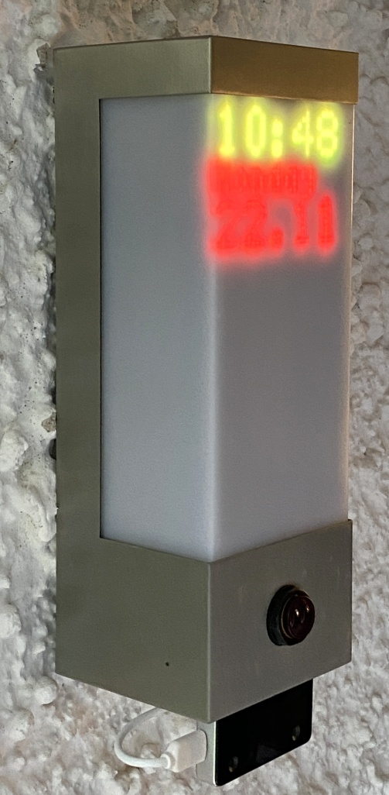
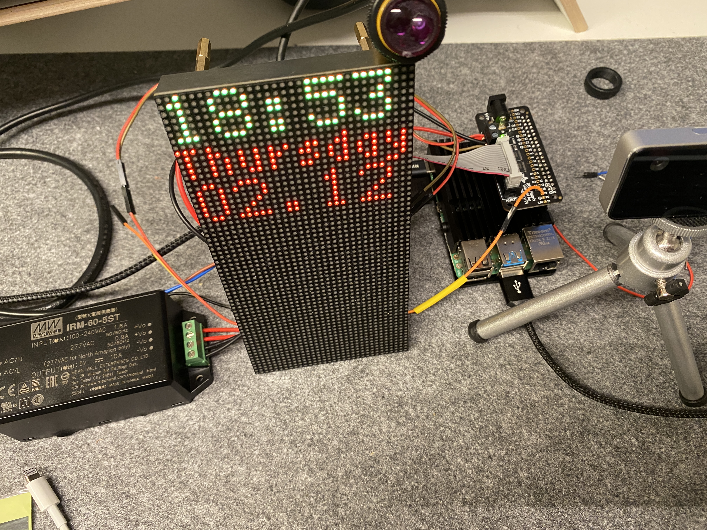
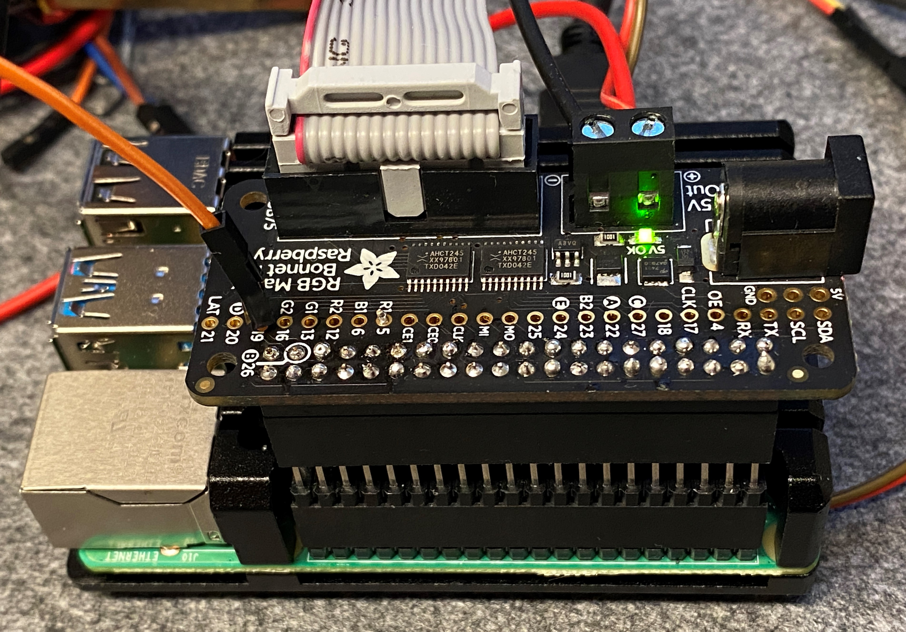
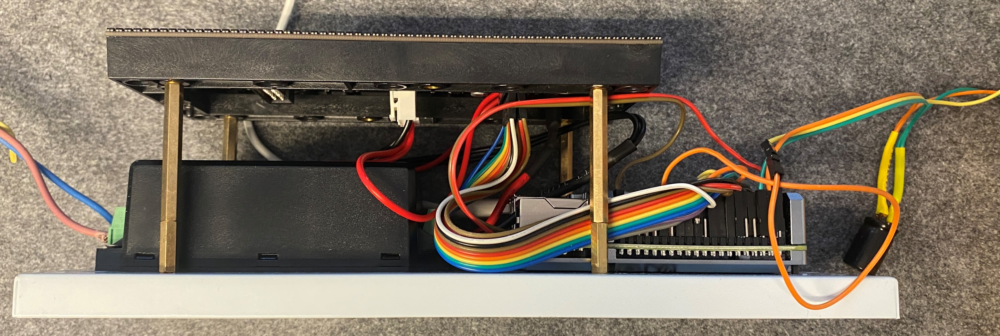
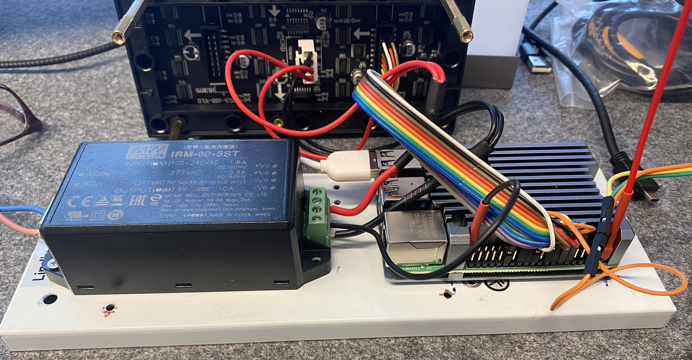
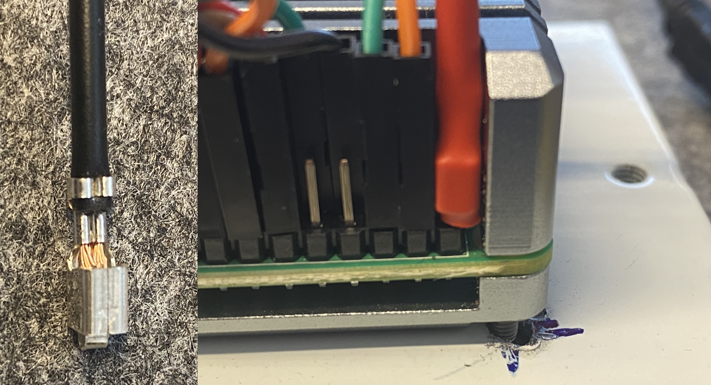
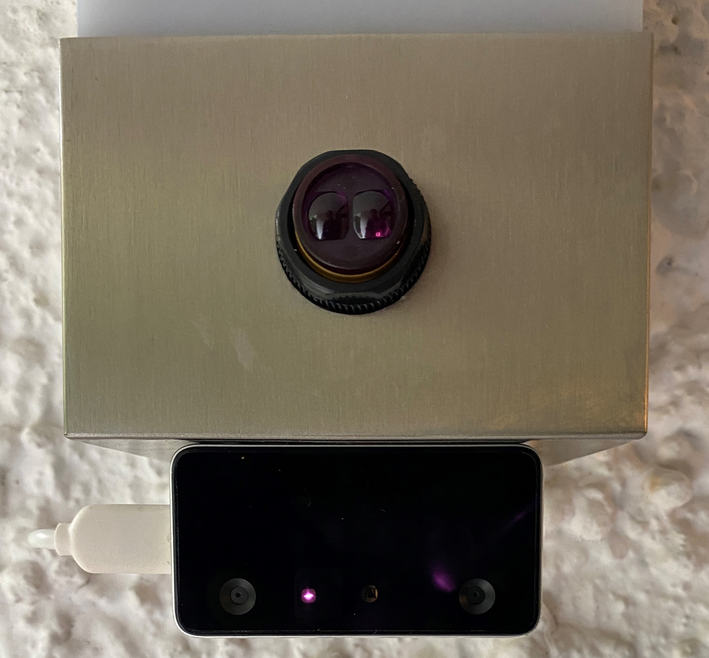
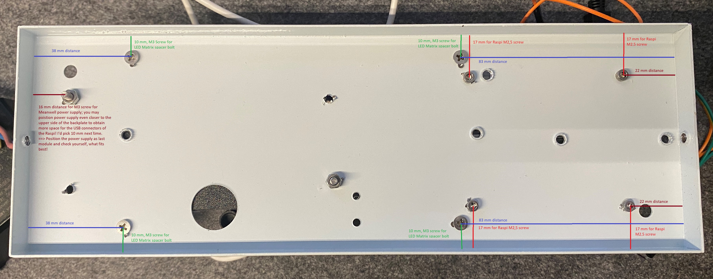
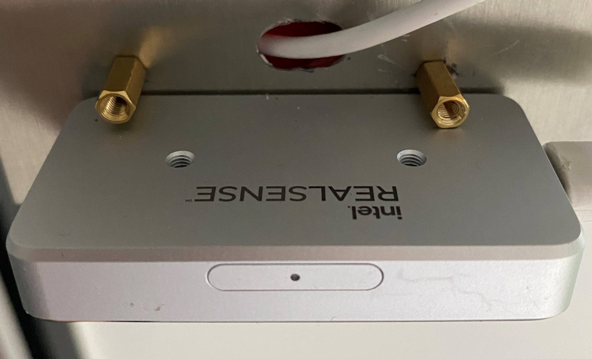
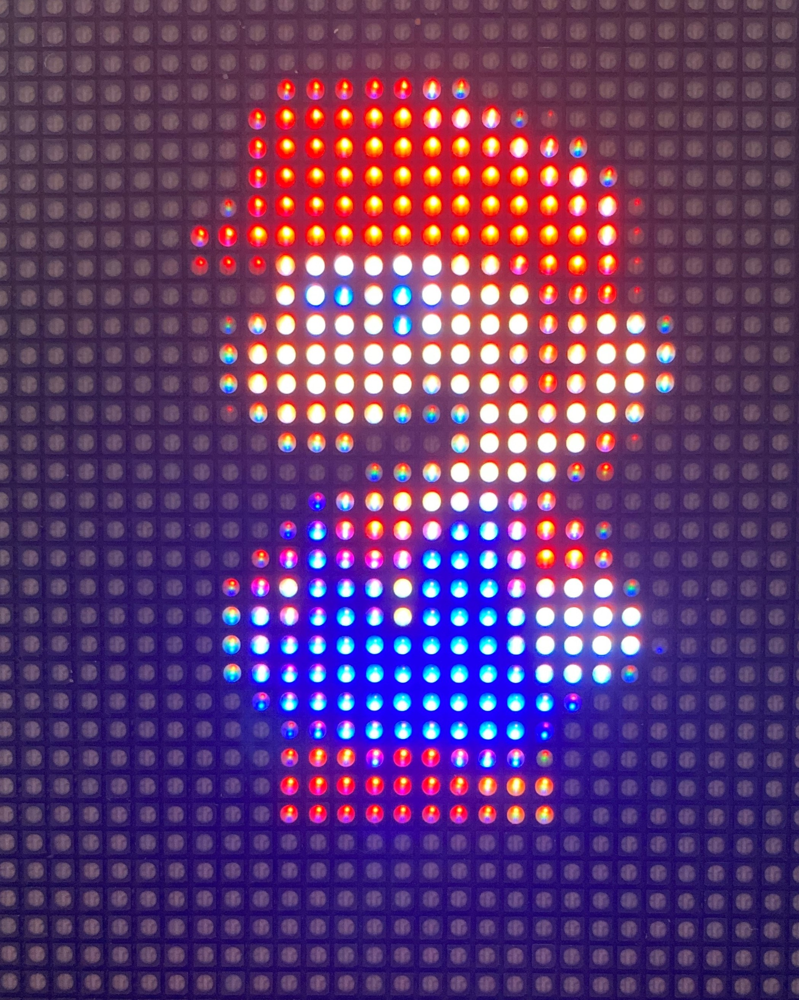

<p align="right"><a href="./README.md" rel="noopener">🇬🇧 English version</a></p>

<p align="center">
  
</p>

<h1 align="center">smartdoorF455</h1>
<p align="center"><i>Ein Türöffner mit biometrischer 3D-Gesichtsauthentifizierung für den Raspberry Pi.</i></p>

<div align="center">

[](/LICENSE)


</div>

---

Mit dem iPhone X im September 2017 etablierte Apple die Authentifizierung anhand biometrischer Gesichtsmerkmale als zuverlässige Alltagstechnologie. Dieses Projekt überträgt genau diese Idee – vom Smartphone ins Smart Home – als **Türöffner mit Gesichtserkennung**, aufgebaut rund um die Intel-RealSense-ID-F455-Kamera und einen Raspberry Pi.

> 📖 Sie suchen die Entwickler-Dokumentation (Ablauf der Anwendung, Code-Struktur, Threading-Modell)?
> Siehe **[docs/GUIDE.md](docs/GUIDE.md)**. Dieses README ist die Bau- und Installationsanleitung für Maker.

## 📝 Inhaltsverzeichnis

- [📝 Inhaltsverzeichnis](#-inhaltsverzeichnis)
- [🧐 Über das Projekt](#-über-das-projekt)
- [🏁 Erste Schritte](#-erste-schritte)
- [🔨 Voraussetzungen](#-voraussetzungen)
- [⚙️ Funktionsweise](#️-funktionsweise)
- [🛠️ Hardware-Aufbau](#️-hardware-aufbau)
  - [Verkabelung](#verkabelung)
  - [Präsenzsensor](#präsenzsensor)
  - [Einbau ins Gehäuse](#einbau-ins-gehäuse)
- [💾 Software-Installation](#-software-installation)
- [🔧 Konfiguration](#-konfiguration)
- [📚 Dokumentation](#-dokumentation)
- [🎈 Verwendung](#-verwendung)
- [🧑‍🤝‍🧑 Gesichter anlernen](#-gesichter-anlernen)
- [🚪 Die Tür öffnen](#-die-tür-öffnen)
- [📡 Mosquitto-MQTT-Broker](#-mosquitto-mqtt-broker)
- [🔒 Kamera-Sicherheit](#-kamera-sicherheit)
- [🚀 Optimierung](#-optimierung)
- [♻️ Status der Intel RealSense ID F455](#️-status-der-intel-realsense-id-f455)
- [🩺 Fehlerbehebung](#-fehlerbehebung)
  - [Hardware](#hardware)
  - [Software](#software)
- [✨ Varianten \& Erweiterungen](#-varianten--erweiterungen)
- [📌 Fazit](#-fazit)
- [🎥 Video](#-video)
- [⛏️ Verwendete Software](#️-verwendete-software)
- [✍️ Autor](#️-autor)
- [🎉 Danksagung](#-danksagung)

## 🧐 Über das Projekt

Anfang 2021 kündigte Intel die Kamera RealSense ID F455 an. Sie greift dasselbe Prinzip der 3D-Gesichtsauthentifizierung auf und bietet Makern ein attraktives Produkt zur Integration in eigene Lösungen. Die Kamera überzeugt mit umfangreicher Dokumentation, einem quelloffenen SDK für Linux, Windows und Android sowie Anbindungen für C, C++, C# und Python.

Anders als Apples Face ID kann sie **mehr als eine Person** authentifizieren – die Profile werden entweder zentral auf einem Server oder in einer Datenbank auf der Kamera selbst gespeichert. Damit ist die RealSense ID F455 der perfekte Kandidat, um die Haustür per 3D-Gesichtserkennung zu öffnen, mit einer ähnlich niedrigen Fehlerrate wie ein iPhone.

<p align="center">
  
</p>

## 🏁 Erste Schritte

Wenn Sie über den Bau eines smarten Türöffners mit 3D-Gesichtsauthentifizierung nachdenken, **suchen Sie zuerst nach einer IP-Schnittstelle zu Ihrem Türöffner**. Das ist der kniffligste Teil eines jeden Nachbaus, denn die Anforderungen unterscheiden sich von Tür zu Tür und erfordern womöglich etwas Kreativität.

Für dieses Projekt haben wir mit einer **Siedle-bus-basierten** Türsprechanlage gearbeitet. Je nach Sprechanlage und IP-Gateway müssen Sie den Code anpassen, der den Öffner auslöst – siehe [Die Tür öffnen](#-die-tür-öffnen). Wenn Sie kein MQTT zum Öffnen der Tür nutzen, setzen Sie `use_mosquitto = false` in `bin/config.toml` und passen Sie den Auslöser entsprechend an.

## 🔨 Voraussetzungen

Die Hardware für dieses Maker-Projekt kostet insgesamt rund **~500 USD**, ohne ein IP-Gateway zum Türöffner.

**Kernkomponenten**

- Intel RealSense ID F455 Kamera
- Raspberry Pi 4B, ≥ 4 GB RAM, mit Raspberry Pi OS
- microSD-Karte ≥ 16 GB
- 5-V-Netzteil, z. B. Meanwell IRM-60-5ST (5 V, 10 A)
- Gehäuse, z. B. die Außenleuchte *Severina* mit Sensor von Lindby
- RGB-LED-Matrix 64×32, P2,5, 160×80 mm, z. B. Adafruit 5036
- Reflex-Infrarot-Lichtschranke E18-D80NK
- 10-kΩ-Pull-up-Widerstand
- 40-poliges GPIO-Flachbandkabel oder 20× Buchse/Buchse-Jumperkabel
- Abstandsbolzen für die LED-Matrix: 4× 40 mm, 4× 15 mm, 2× 10 mm (M3)
- 8× M3-Muttern zur Befestigung der Abstandsbolzen an der Gehäuseplatte
- 4× M2,5-Schrauben 12 mm zur Befestigung des Pi an der Gehäuseplatte
- ¼-Zoll-Schraube zur Befestigung der Kamera an der Gehäuseunterseite
- Eine IP-basierte Schnittstelle zum Türöffner (dieser Code setzt MQTT voraus; wir nutzten eine „Siedle-Bus“-Sprechanlage mit einem MQTT-Gateway von Oskar Neumann)

**Optional**

- Geeek Pi Raspberry Pi 4 Armor Case
- Adafruit RGB Matrix Bonnet
- 40-poliger Pitch-Stacking-Header, um das Bonnet über das Armor Case zu heben
- PIR-Sensor HC-SR501 als Alternative zur Lichtschranke

## ⚙️ Funktionsweise

Der smarte Türöffner hat eine veraltete Eingangsleuchte ersetzt und steckt in deren Gehäuse. Das System wird ausschließlich mit Netzspannung versorgt und kommuniziert über das hauseigene WLAN – achten Sie deshalb darauf, dass am Montageort ein guter WLAN-Empfang besteht.


*Smarter Türöffner im Gewand einer Außenleuchte*

Da die Kamera selbst keinen Präsenzmelder besitzt, wird sie über eine Infrarot-Reflexlichtschranke ausgelöst. Wer Einlass begehrt, wischt mit der Hand an der Lichtschranke vorbei – oder kommt mit dem Gesicht einfach etwas näher. Kurz ist ein schwaches rotes Glimmen des Infrarot-Illuminators der kopfüber montierten Kamera an der Unterseite des Gehäuses zu sehen.

Die Kamera projiziert nun unsichtbare Infrarotpunkte mit 850 nm Wellenlänge auf das Gesicht, erfasst sie mit zwei seitlich integrierten Full-HD-Kameras und bildet daraus eine dreidimensionale Punktwolke, die sie per KI-Inferenz mit den gespeicherten Gesichtsprofilen abgleicht. Die Authentifizierung dauert **weniger als eine Sekunde**; das Ergebnis – im positiven Fall der Name der erkannten Person – wird per USB an den Raspberry Pi übertragen. Da wir nur eine Kamera nutzen, werden die Profile lokal auf ihr gespeichert. (Für mehrere Zugänge bietet die Kamera zudem einen Servermodus, in dem die Profile auf einem zentralen Server liegen und von mehreren Kameras genutzt werden können.)

Bei Erfolg wird der erkannte Name für einige Sekunden auf der LED-Matrix angezeigt und die Tür per MQTT-Befehl über WLAN geöffnet. Im Ruhezustand zeigt die Matrix die Uhrzeit, den Wochentag und das aktuelle Datum.

Eine Demonstration finden Sie auf YouTube:

[](https://www.youtube.com/watch?v=hRnp7CBBR0Q)

*YouTube – so funktioniert der smarte Türöffner mit 3D-Gesichtserkennung*

## 🛠️ Hardware-Aufbau

Als Host-Rechner dient ein Raspberry Pi 4B mit Raspberry Pi OS (alias Raspbian). Als Gehäuse haben wir eine Außenleuchte im Edelstahlgehäuse gewählt, die vor der Haustür unauffällig wirkt. Neben dem Pi enthält es ein 50-W-5-V-Netzteil, einen Reflexsensor und ein Adafruit-5036-LED-Matrix-Display (64×32 RGB-LEDs).

Die Matrix wird mit vier Abstandsbolzen von je 55 mm Gesamtlänge (40 mm + 15 mm) an der Grundplatte montiert. Das Matrixmodul ist 15 mm dick, sodass zwischen Grundplatte und der satinierten Acrylglasfront 70 mm bleiben. Damit der Matrixinhalt hinter dem satinierten Acryl nicht zu unscharf wird, muss das Modul in **direktem Kontakt** mit dem Acrylglas stehen.

Bevor der Aufbau in das zerlegte Lampengehäuse integriert wird, verkabeln Sie die Komponenten als Prototyp und testen jedes Bauteil – und das Gesamtsystem.



*Erster Test im Prototypenaufbau*

### Verkabelung

Es gibt zwei Möglichkeiten, das RGB-Matrix-Display mit dem Raspberry Pi zu verbinden.

**Variante 1 – Adafruit RGB Matrix HAT/Bonnet**

Die Steckplatine bietet eine aufgeräumte Verkabelung über den HUB75-Anschluss, der dem LED-Matrix-Modul beiliegt. Damit sie dem Armor Case des Pi nicht in die Quere kommt, muss sie mit einem 40-poligen Pitch-Stacking-Header angehoben werden – zum Preis eines höheren Aufbaus (ca. 6 cm). Da der Pi gegenüber dem Sensor im unteren Teil des Gehäuses sitzt, ist das für den PIR-Sensor HC-SR501 in Ordnung, führt aber beim 5,5 cm langen E18-D80NK zu einer Kollision. Bei Verwendung der E18-D80NK-Lichtschranke empfehlen wir daher entweder die unten gezeigte diskrete Verkabelung oder einen Platztausch – Netzteil in den unteren Teil, Pi in den oberen Teil des Gehäuses.

Der Pi wird über die Hohlbuchse oder die Schraubklemmen am Adafruit Bonnet versorgt. Das Bonnet nutzt außerdem weitere [GPIO](https://www.heise.de/tipps-tricks/Raspberry-Pi-Das-koennen-die-GPIO-Pins-4583823.html)-Pins zur Kommunikation, weshalb wir mit Bonnet **GPIO 19** für den Präsenzsensor verwenden. Dafür muss ein Jumperkabel für den Sensorausgang auf das Bonnet gelötet werden.



*Adafruit Matrix Bonnet auf einem Pitch-Stacking-Header, mit Jumperkabel über das Armor Case an GPIO 19 gelötet*

**Variante 2 – Diskrete Verkabelung mit 40-poligem GPIO-Flachbandkabel oder Buchse/Buchse-Jumperkabel**



*Diskrete Verkabelung; die LED-Matrix auf 55-mm-Abstandsbolzen umschließt Pi und Netzteil*



*Diskrete Verkabelung mit Jumperkabeln*

Die diskrete Verkabelung mit Jumper- oder Flachbandkabeln ist etwas fummeliger, aber ebenso funktional. Hier wird der Präsenzsensor (PIR oder Lichtschranke) an [GPIO-Pin 5](https://www.heise.de/tipps-tricks/Raspberry-Pi-Das-koennen-die-GPIO-Pins-4583823.html) angeschlossen. Das Meanwell-Netzteil hat am Niederspannungsausgang eine 4-polige Schraubklemme, die sowohl die RGB-Matrix (über das mitgelieferte Kabel) als auch den Pi (über GPIO-Pin 2 für 5 V und GPIO-Pin 39 für GND) versorgt.

Wir empfehlen **nicht**, den Pi über Jumperkabel zu versorgen; verwenden Sie stattdessen ein dickeres Kabel mit größerem Querschnitt und griffigeren Klemmen. Wir haben zwei überzählige Kabelklemmen des LED-Matrix-Netzteils zweckentfremdet, mit einem kleinen Schraubendreher herausgezogen und mit Schrumpfschlauch überzogen, damit an GPIO-Pin 2 kein Kurzschlussrisiko entsteht.



*Zweckentfremdung zweier 5-V-Zuleitungen des LED-Matrix-Moduls zur Versorgung des Pi*

Eine ausführliche Anleitung zur diskreten Verkabelung des LED-Matrix-Moduls finden Sie hier:
<https://github.com/hzeller/rpi-rgb-led-matrix/blob/master/wiring.md>



*Kamera kopfüber an der Unterseite des Gehäuses montiert*

Die Kamera wird kopfüber an der Unterseite des Gehäuses befestigt. Das mitgelieferte USB-C-Kabel wird durch ein hinter der Kamera zu bohrendes Loch ins Gehäuse geführt und an einen der vier USB-A-Ports des Raspberry Pi gesteckt.

### Präsenzsensor

Das vordere Gehäuseloch, das eigentlich für die PIR-Linse vorgesehen war, wird mit der Reflex-Infrarotlichtschranke gefüllt, die innen und außen mit den beiden beiliegenden Kunststoffmuttern verschraubt wird. Mit dem Adafruit Matrix Bonnet wird der Sensor mit 5 V vom Bonnet versorgt: Führen Sie das braune Kabel zur Klemme mit der Beschriftung „5V Out“.

Bei diskreter Verkabelung gibt es mehrere Wege, 5 V von den [GPIO](https://www.heise.de/tipps-tricks/Raspberry-Pi-Das-koennen-die-GPIO-Pins-4583823.html)-Pins zu beziehen – z. B. +5 V an Pin 4 und GND (blaues Kabel) an Pin 34. Der Sensorausgang (schwarzes Kabel) wird an Pin 29 angeschlossen, also den logischen **GPIO 5**.

Wenn keine Wand oder ein ähnliches, Infrarot reflektierendes Objekt gegenüber der Tür vorhanden ist, können Sie statt der Lichtschranke einen PIR-Sensor (z. B. den HC-SR501) verwenden. In unserem Fall erzeugte der PIR jedoch viele Fehlauslöser und triggerte die Kamera häufig: Das LED-Matrix-Modul flackert für das menschliche Auge unsichtbar und irritierte den PIR-Sensor über eine gegenüberliegende Wand.

### Einbau ins Gehäuse

Das Gehäuse der sensorgesteuerten Außenwandleuchte *Severina* von Lindby passt zur 160 × 80 mm großen RGB-LED-Matrix und bietet gerade genug Platz für alle Komponenten. Für die Montage müssen einige Löcher in die Rückwand gebohrt werden.



*Rückwand mit zusätzlichen Bohrungen*

Die Kamera wird von der Gehäuseinnenseite mit einer ¼-Zoll-Schraube an das untere Edelstahlblech geschraubt. Damit sich die wertvolle Kamera nicht einfach herausdrehen lässt, wird sie mit zwei 10 mm langen Abstandsbolzen gesichert.



*Abstandsbolzen als Diebstahlschutz – und eine noch fehlende Kabeltülle 😮*

## 💾 Software-Installation

`smartdoorF455` ist eine **C++17**-Anwendung. Das gesamte Verhalten wird über die Konfigurationsdatei `bin/config.toml` gesteuert – für normale Einstellungsänderungen gibt es nichts zu `#define`-en oder neu zu kompilieren.

Der Build nutzt **CMake-Presets**. Beim ersten Konfigurieren lädt und baut CMake die projektspezifischen Abhängigkeiten automatisch (RealSense ID SDK, tgbot-cpp, toml++, WiringPi, rpi-rgb-led-matrix, PeriodicExecutor), sodass Sie nur die Systembibliotheken selbst installieren müssen. Auf einem Raspberry Pi dauert der erste Build eine Weile.

```bash
# 1. Systempakete (Raspberry Pi OS / Debian)
sudo apt-get update && sudo apt-get upgrade -y
sudo apt-get install -y git cmake build-essential
sudo apt-get install -y libopencv-dev libssl-dev libmosquitto-dev \
                        libboost-thread-dev libboost-chrono-dev

# 2. Quellcode holen
git clone https://github.com/joergwall/smartdoorF455.git
cd smartdoorF455

# 3. Konfigurieren und bauen (CMake lädt die übrigen Abhängigkeiten)
cmake --preset default
cmake --build build -j4

# 4. Optional: Binärdatei nach /usr/local/bin installieren
sudo cmake --install build
```

Nach einem erfolgreichen Build:

- liegt die ausführbare Datei unter **`bin/smartdoorF455`**,
- werden die LED-Matrix-Schriften (`6x12.bdf`, `4x6.bdf`) nach **`fonts/`** kopiert,
- landen Laufzeit-Logs und die PID-Datei im Verzeichnis **`log/`** im Projektstamm.

> Wenn Sie das Preset nicht verwenden möchten, lautet die Entsprechung:
> `cmake -S . -B build -DCMAKE_BUILD_TYPE=Debug && cmake --build build -j4`

## 🔧 Konfiguration

Kopieren Sie die kommentierte Beispieldatei nach `bin/config.toml` und passen Sie sie an Ihre Hardware und Ihr Netzwerk an:

```bash
cp bin/config.toml.example bin/config.toml
$EDITOR bin/config.toml
```

Jeder Schlüssel hat einen sicheren Standardwert; die Beispieldatei dokumentiert jeden Eintrag inline. Die wichtigsten Abschnitte sind:

- **`[raspi]`** – `gpio_sensor_pin` (mit Adafruit Bonnet `19`, sonst `5`), `gpio_sensor_pull` (`0`=aus, `1`=down, `2`=up) und `wait_time_until_reauthentication` (Wartezeit in Sekunden).
- **`[mosquitto]`** – `use_mosquitto`, `host`, `port`, `keepalive`, `client_id`, `topic_door` (wohin der Befehl `open` veröffentlicht wird) und `topic_control`.
- **`[camera]`** – `camera_rotation`, `security_level`, `algo_flow`, `dump_mode`, `matcher_confidence_level`, `frontal_face_policy`, `max_spoofs`, `gpio_auth_toggling`. Diese werden direkt auf die RealSense-ID-Gerätekonfiguration abgebildet.
- **`[matrix_options]`** – `hardware_mapping` (`"adafruit-hat"` für das Bonnet, `""` für diskrete Verkabelung), `brightness`, `pixel_mapper_config`, die verschiedenen `*_color`-Tripel sowie ein optionales `font_dir`.
- **`[telegram]`** – `use_telegram`, `bot_token`, `chat_id`, `send_snapshot`.

Beispielhaft entspricht dies in etwa unserer Konfiguration:

```toml
# This is a TOML config file for smartdoorF455
title = "TOML configuration file for smartdoorF455"

[raspi]
gpio_sensor_pin = 5  # 19 bei Adafruit Bonnet, sonst 5
gpio_sensor_pull = 2 # 0=PUD_OFF, 1=PUD_DOWN, 2=PUD_UP (siehe WiringPi)
wait_time_until_reauthentication = 5 # Sekunden bis zum nächsten Versuch

[mosquitto] # MQTT zur Türkommunikation
use_mosquitto = true
host = "localhost"
port = 1884
keepalive = 600
client_id = "smartdoorF455"     # eindeutige client_id
topic_door = "siedle/exec"      # Topic, das die Tür öffnet
topic_control = "smartdoorF455" # Topic für Interaktionen wie das Anlernen von Nutzern

[camera] # siehe https://github.com/IntelRealSense/RealSenseID/blob/master/include/RealSenseID/DeviceConfig.h
camera_rotation = "180"          # 0 (Standard), 90, 180, 270
security_level = "Low"           # High, Medium, Low (Standard)
                                 # Medium/High verursachten in unseren Tests zu
                                 # viele falsche Spoof-Meldungen (v1.3.1 / Mai 2025)
algo_flow = "All"                # All, FaceDetectionOnly (Standard), SpoofOnly, RecognitionOnly
dump_mode = "CroppedFace"        # None (Standard), CroppedFace, FullFrame
matcher_confidence_level = "High"# High, Medium, Low (Standard)
frontal_face_policy = "Moderate" # Strict, Moderate, None (Standard)
max_spoofs = 0                   # max. aufeinanderfolgende Spoof-Versuche vor Ablehnung
gpio_auth_toggling = 0           # 1 = GPIO nach erfolgreicher Auth umschalten, 0 = aus (Standard)

[matrix_options] # LED-Matrix-Display
# font_dir = ""                  # optionaler absoluter Pfad zu den .bdf-Schriften;
                                 # bei leerem Wert werden die Schriften automatisch gesucht
hardware_mapping = ""            # "adafruit-hat" fürs Bonnet, "" für diskrete Verkabelung
brightness = 80                  # 0..100 Prozent
pixel_mapper_config = "Rotate:270" # "Rotate:0" | "Rotate:90" | "Rotate:180" | "Rotate:270"
clock_color = [255, 255, 0]      # RGB, Werte 0..255
date_color = [255, 28, 0]
day_color = [255, 28, 0]
username_color = [255, 0, 255]
bg_color = [0, 0, 0]             # Hintergrund (Standard Schwarz)
outline_color = [0, 0, 0]        # Umriss (Standard keiner)

[telegram] # optional: Ereignismeldungen an einen Telegram-Bot weiterleiten
use_telegram = false
# bot_token = "[enter your telegram bot_token here]"
# chat_id über https://api.telegram.org/bot<YourBotToken>/getUpdates ermitteln
# chat_id = [enter chat_id number here]
send_snapshot = true # Foto jedes Authentifizierungsversuchs senden.
                     # Datenschutz-/DSGVO-Aspekte beachten, besonders wenn das
                     # Bild Teile fremden Eigentums zeigen kann.
```

> `bin/config.toml` kann Geheimnisse (Ihren Telegram-Bot-Token) enthalten und ist von Git ausgeschlossen. Halten Sie nur `bin/config.toml.example` unter Versionskontrolle.

## 📚 Dokumentation

Zwei sich ergänzende Dokumente beschreiben die Software:

- **[docs/GUIDE.md](docs/GUIDE.md)** – ein menschenlesbarer Entwickler- und Benutzerleitfaden (Ablauf der Anwendung, Code-Struktur, Threading-Modell, Fehlerbehebungstabelle).
- **Doxygen-API-Referenz** – erzeugt aus den Doxygen-Kommentaren im Quellcode.

Der Quellcode ist als kleine, fokussierte C++17-Codebasis unter [`src/`](src) organisiert: der Einstiegspunkt [`src/main.cpp`](src/main.cpp), die Laufzeitsteuerung in [`src/application.cpp`](src/application.cpp) / [`src/application.hpp`](src/application.hpp), die Konfigurationsbehandlung in [`src/config.cpp`](src/config.cpp) / [`src/config.hpp`](src/config.hpp) sowie die Anzeigedarstellung in [`src/matrix_display.cpp`](src/matrix_display.cpp) / [`src/matrix_display.hpp`](src/matrix_display.hpp).

So erzeugen Sie die HTML-API-Referenz:

```bash
# über das CMake-Ziel (empfohlen)
cmake --build build --target doc

# ...oder direkt, aus dem Projektstamm
doxygen src/doxygen.conf
```

Öffnen Sie anschließend [`docs/html/index.html`](docs/html/index.html).

## 🎈 Verwendung

Die Anwendung wird über das Startskript in [`bin/`](bin) verwaltet:

```bash
cd bin
./run_smartdoorF455.sh start        # im Hintergrund starten
```

Weitere nützliche Befehle:

```bash
./run_smartdoorF455.sh status       # läuft es? (zeigt die aktuelle PID)
./run_smartdoorF455.sh stop         # laufenden Prozess stoppen
./run_smartdoorF455.sh restart      # stoppen, dann starten
./run_smartdoorF455.sh foreground   # im Vordergrund im Terminal ausführen
./run_smartdoorF455.sh start --config /pfad/zu/eigener-config.toml
./run_smartdoorF455.sh start --logdir /pfad/zu/logs --no-taskset
```

Das Startskript schreibt seine Log-Ausgabe und die PID-Datei in das Verzeichnis `log/` im Projektstamm. Auch bevor ein Gesicht angelernt wurde, sollte die LED-Matrix Uhrzeit, Wochentag und Datum anzeigen. Falls nicht, siehe [Fehlerbehebung](#-fehlerbehebung).

## 🧑‍🤝‍🧑 Gesichter anlernen

Um der Kamera die Gesichter autorisierter Nutzer beizubringen, verwenden Sie das Kommandozeilenwerkzeug aus Intels RealSense-ID-SDK. Falls das Gerät `/dev/ttyACM0` fehlt, probieren Sie stattdessen `/dev/ttyACM1`.

Stellen Sie im Menü des Werkzeugs mit `s` die **Rotation** passend zur Montage der Kamera ein (`0` aufrecht, `180` kopfüber – so wie beim Anschrauben an die Gehäuseunterseite). Mit `e` lernen Sie dann einen Nutzer an, wobei das Profil lokal auf der Kamera gespeichert wird. Halten Sie das Gesicht etwa **30–50 cm** von der Kamera entfernt.

```bash
# Intel RealSense ID SDK installieren (für das Anlern-CLI)
git clone https://github.com/IntelRealSense/RealSenseID.git
cd RealSenseID
mkdir build && cd build
cmake .. -DRSID_PREVIEW=1
make -j4

# Anlern-CLI ausführen
cd ~/RealSenseID/build/bin
sudo ./rsid-cli /dev/ttyACM0
```

```text
Connected to device

Authentication settings:
 * Rotation: 0 Degrees
 * Security: High
 * Algo flow Mode: All
 * Face policy : Single
 * Dump Mode: CroppedFace
 * Matcher Confidence Level : High

Please select an option:
  'e' to enroll.
  'a' to authenticate.
  'd' to delete all users.
  'c' to capture images from device.
  's' to set authentication settings.
  'g' to query authentication settings.
  'u' to query ids of users.
  'n' to query number of users.
  'b' to save device's database before standby.
  'v' to view additional information.
  'x' to ping the device.
  'q' to quit.

server mode options:
  'E' to enroll with faceprints.
  'A' to authenticate with faceprints.
  'U' to list enrolled users
  'D' to delete all users.

> e
User id to enroll: Julia
Connected to device
  *** Hint Success
  *** Hint Success
```

Wiederholen Sie dies für jede autorisierte Person.

> **Hinweis zu Namen:** Die LED-Matrix kann nur eine begrenzte Anzahl Zeichen anzeigen. Mit der Standard-Schrift 6×12 passen etwa **5 Zeichen** auf das gedrehte Panel. Verwenden Sie eine Abkürzung oder ändern Sie den Zeichenaufruf für den Namen in [`src/matrix_display.cpp`](src/matrix_display.cpp) auf die schmalere `font4x6_` (bis zu ~8 Zeichen) und bauen Sie neu.

## 🚪 Die Tür öffnen

Um mit dieser Lösung die Haustür zu entriegeln, muss Ihre Türsprechanlage eine IP-Schnittstelle bereitstellen. Wenn Sie einen Nachbau planen, analysieren Sie zuerst Ihre Klingelanlage im Detail und suchen Sie nach Möglichkeiten, eine solche Schnittstelle zu ergänzen.

Unsere Siedle-bus-basierte Sprechanlage wird über ein Gateway von Oskar Neumann angesteuert, das MQTT-Befehle über WLAN in den Siedle-Bus übersetzt (dieses Gateway ist nicht mehr erhältlich). Siedle bietet mit dem **Smart Gateway SG-150** eine IP-Schnittstelle an, die mit über 600 USD für ein DIY-Projekt jedoch ein happiger Brocken ist. Weitere, von uns *nicht* getestete Siedle-IP-Schnittstellen sind Drittanbieter-Gateways wie von [Hamares](http://hamares.de/?Tuersprechadapter_TM_lll_ab_light) oder der smarte Türöffner von [SMS Guard](https://www.sms-guard.org/downloads/smarter-Tueroeffner-Anleitung.pdf), der ebenfalls eine MQTT-Schnittstelle bietet.

Wer bereits eine IP-basierte Sprechanlage betreibt, hat Glück. Die Tür wird von der Funktion `Application::publishDoorOpen()` in [`src/application.cpp`](src/application.cpp) geöffnet, die die Nachricht `open` an das konfigurierte `topic_door` veröffentlicht. Für eine andere Schnittstelle passen Sie diese Funktion an. Lässt sich Ihr Öffner beispielsweise per HTTP-Anfrage auslösen, ersetzen Sie das MQTT-Publish durch einen Systemaufruf:

```cpp
// Beispiel: Tür per HTTP-Anfrage statt per MQTT öffnen.
// Annahme: Der Öffner reagiert auf:
//   http://192.168.178.27:8083/fhem?cmd=set%20Siedle%20open
// Stellen Sie sicher, dass curl installiert ist: sudo apt install curl
// und setzen Sie use_mosquitto = false in bin/config.toml.

system("curl 'http://192.168.178.27:8083/fhem?cmd=set%20Siedle%20open'");
```

## 📡 Mosquitto-MQTT-Broker

Wenn Sie MQTT zur Kommunikation mit dem Türöffner nutzen, erstellen Sie diese Konfiguration für den Mosquitto-Broker auf dem Pi:

```bash
sudo apt-get install -y mosquitto mosquitto-clients
sudo nano /etc/mosquitto/conf.d/mymosquitto.conf
```

Fügen Sie die folgenden Zeilen hinzu:

```conf
listener 1883
listener 1884
allow_anonymous true
```

Starten Sie anschließend den Broker neu:

```bash
sudo systemctl restart mosquitto
```

Zur Fehlersuche können Sie mit einem Mosquitto-Client die vom Broker ausgetauschten Nachrichten mithören:

```bash
mosquitto_sub -d -t "#"
```

In [c't 6/2018, S. 164](https://www.heise.de/select/ct/2018/6/1520740468882312) erklärt Jan Mahn MQTT ausführlich, einschließlich der Absicherung per Verschlüsselung – die wir hier der Einfachheit halber weggelassen haben. Dadurch ist diese Lösung nur so sicher wie Ihr heimisches WLAN. Der Artikel ist für jeden Maker empfehlenswert, der MQTT einsetzen möchte.

## 🔒 Kamera-Sicherheit

Das RealSense-ID-SDK bietet einen sicheren Kommunikationsmodus, der die Kamera mit dem Host koppelt und ihre Kommunikation verschlüsselt. Das verhindert, dass ein ungebetener Gast Zutritt erlangt, indem er kurzerhand eine *andere* RealSense-ID-Kamera per USB-C mit eigenen Gesichtsprofilen ansteckt. Wir haben diesen Modus hier der Einfachheit halber nicht aktiviert. Eine Anleitung finden Sie beim Hersteller:

<https://github.com/IntelRealSense/RealSenseID#secure-communication>

## 🚀 Optimierung

Um einen der vier CPU-Kerne exklusiv für unsere Anwendung zu reservieren (und ihn dem Prozess-Scheduler zu entziehen), bearbeiten Sie:

```bash
sudo nano /boot/cmdline.txt
```

Hängen Sie `isolcpus=3` ans Ende der einzelnen Zeile an, sodass sie etwa so aussieht:

```text
console=serial0,115200 console=tty1 root=PARTUUID=e0d8ecc0-02 rootfstype=ext4 fsck.repair=yes rootwait quiet splash plymouth.ignore-serial-consoles isolcpus=3
```

Dies wird nach einem Neustart wirksam und hilft, ein Flackern der LED-Matrix zu vermeiden. Das Startskript bindet den Prozess beim Start mit `taskset` an den isolierten Kern (mit `--no-taskset` deaktivierbar).

## ♻️ Status der Intel RealSense ID F455

Intel hat die RealSense ID F455 am [28. Februar 2022 eingestellt](https://www.therobotreport.com/wp-content/uploads/2021/09/intel-realsense-end-of-life.pdf). Diese End-of-Life-Entscheidung wurde später (2024) zurückgenommen, die gesamte RealSense-Kameralinie in eine eigenständige [RealSense-Gesellschaft](https://realsenseai.com/) ausgegliedert und der Kamera glücklicherweise neues Leben eingehaucht. Die aktuellsten Informationen zu den Produkten der Gesichtsauthentifizierung finden Sie [hier](https://realsenseai.com/facial-authentication/).

## 🩺 Fehlerbehebung

Beim Nachbau (Netzteil, LED-Matrix, Pi und optional Matrix-Bonnet) können hier und da kleine Probleme auftreten. Hier sind die uns bekannten.

### Hardware

**Stromversorgung.** Der Pi reagiert empfindlich, wenn seine Versorgungsspannung unter den kritischen Wert von 4,63 V fällt – die rote LED beginnt zu blinken oder erlischt ganz. Das Meanwell-Netzteil liefert eine stabile Spannung, aber wie unter [Verkabelung](#verkabelung) erwähnt, sollten Sie auf ausreichenden Kabelquerschnitt und griffige Klemmen achten. Messen Sie im Zweifel die Spannung an den GPIO-Pins 2/4 und 6 mit einem Multimeter und verstärken Sie bei Bedarf mit einem zusätzlichen Kabel.

**Verzerrtes Bild auf der LED-Matrix.** Wenn das LED-Matrix-Bonnet über einen 40-poligen Pitch-Stacking-Header angehoben wird, kann ein wackliger Header Probleme bereiten. Besonders der dem Armor Case beiliegende Header machte uns Ärger. Elektronikversender bieten vergoldete Pitch-Stacking-Header günstig an; die haben sich bei uns bewährt.

### Software

Prüfen Sie zuerst die aktuellste Logdatei auf aufschlussreiche Fehlermeldungen:

```bash
cd log
ls -la
more ./20211216_092446_smartdoorF455.log
```

**`Couldn't load font files` / `failed to load matrix fonts`.** Stellen Sie sicher, dass das Verzeichnis `fonts/` existiert und `6x12.bdf` sowie `4x6.bdf` enthält (ein Neubau erzeugt es neu), oder setzen Sie `font_dir` im Abschnitt `[matrix_options]` von `bin/config.toml` auf den absoluten Pfad der Schriften.

**`on_result: Error`.** Sie wischen mit der Hand am Sensor vorbei, aber es gibt kein schwaches rotes Glimmen des Infrarot-Illuminators – die Kamera startet die Authentifizierung nicht. Nach einem Neustart initialisiert sich die Kamera manchmal beim ersten Start nicht korrekt. Stoppen Sie die Anwendung und starten Sie sie neu:

```bash
./run_smartdoorF455.sh restart
```

**`initInitialise: Can't lock /var/run/pigpio.pid — cannot initialize GPIO`.** Ein anderer Prozess belegt die GPIO. Ein Neustart der Anwendung (wie oben) behebt dies meist.

**LED-Matrix bleibt dunkel.** Kein Fehler im Log und die Matrix ist [korrekt verkabelt](https://github.com/hzeller/rpi-rgb-led-matrix/blob/master/wiring.md), das Display bleibt aber dunkel? Dann ist wahrscheinlich die Einstellung `hardware_mapping` für Ihre Verkabelung falsch. Setzen Sie sie im Abschnitt `[matrix_options]` von `bin/config.toml`: `"adafruit-hat"` mit dem Adafruit Bonnet oder `""` (leer) für [diskrete Verkabelung](#verkabelung), und starten Sie dann neu.

Nach unserer Erfahrung läuft die Software, einmal in Betrieb, tage- und wochenlang stabil. Sogar die Oma lässt den Schlüssel inzwischen zu Hause und verlässt sich auf die Gesichtskontrolle beim Eintreten.

## ✨ Varianten & Erweiterungen

**Ohne RGB-Matrix-Modul.** Wenn Sie auf die LED-Matrix verzichten möchten, kann stattdessen eine einzelne mehrfarbige RGB-LED den Authentifizierungsstatus anzeigen. Das macht das kräftige 5-V-/10-A-Netzteil überflüssig – das übliche USB-C-Netzteil des Pi genügt – und erlaubt einen deutlich schlankeren Aufbau in einem kleineren Gehäuse.

**Ubuntu statt Raspberry Pi OS.** Raspberry Pi OS ist robust und nutzt die Hardware optimal, aber Intels RealSense-ID-SDK wird darauf nur eingeschränkt unterstützt. Als Alternative haben wir Ubuntu Linux 20.04 erfolgreich getestet. Ubuntu wird interessant für erweiterte RealSense-ID-Funktionen, etwa das Erfassen von Kamera-Schnappschüssen, um sie per Telegram-Bot zu versenden. Wenn Sie das SDK weiter erkunden möchten, empfehlen wir, dafür eine separate SD-Karte mit Ubuntu zu bespielen.

**Pixel-Art zur Freude der Nachbarn.** Um lustige Animationen auf der LED-Matrix abzuspielen, nutzen Sie die Beispielprogramme unter `rpi-rgb-led-matrix/utils`. So lässt sich beispielsweise eine GIF-Animation anzeigen:

```bash
# rpi-rgb-led-matrix von Henner Zeller installieren
git clone https://github.com/hzeller/rpi-rgb-led-matrix.git
cd rpi-rgb-led-matrix/
make -C examples-api-use

# utils bauen und ein GIF mit drehendem Super Mario holen
cd utils/
make
wget https://media1.giphy.com/media/QxZEtFE02ofY00gJ71/giphy.gif

# diskrete Verkabelung:
sudo ./led-image-viewer --led-rows=32 --led-cols=64 --led-brightness=90 \
     --led-pixel-mapper "Rotate:270" --led-rgb-sequence=RBG \
     --led-no-hardware-pulse ./giphy.gif

# ...oder mit dem Adafruit RGB Matrix Bonnet:
sudo ./led-image-viewer --led-rows=32 --led-cols=64 --led-brightness=90 \
     --led-pixel-mapper "Rotate:270" --led-rgb-sequence=RBG \
     --led-gpio-mapping=adafruit-hat --led-no-hardware-pulse ./giphy.gif
```



*Pixel-Art: drehender Mario*

Einen tieferen Einblick in die Möglichkeiten des LED-Matrix-Moduls bietet [Pixelart mit Pi, Make-Magazin 5/2021 von Daniel Bachfeld](https://www.heise.de/select/make/2021/5/2118911435627779611).

## 📌 Fazit

Die Nutzerauthentifizierung per dreidimensionaler biometrischer Gesichtserkennung ist ein junges Feld, das der Maker-Community spannende Szenarien eröffnet. Unser Türöffner – genauer: Tür*entriegler*, denn die Haustür öffnen Sie noch selbst – verrichtet seit Wochen zuverlässig seinen Dienst. Wir sind von dieser 3D-Kamera begeistert und froh, dass sie nach einem kurzen End-of-Life-Schreck unter der neuen RealSense-Gesellschaft weiterlebt.

## 🎥 Video

Eine kurze Demonstration der Funktionsweise:

[](https://www.youtube.com/watch?v=hRnp7CBBR0Q)

## ⛏️ Verwendete Software

- [RealSenseID](https://github.com/IntelRealSense/RealSenseID) – SDK für die Intel RealSense ID F455
- [rpi-rgb-led-matrix](https://github.com/hzeller/rpi-rgb-led-matrix) – Henner Zellers LED-Matrix-API
- [WiringPi](https://github.com/WiringPi/WiringPi) – GPIO-Zugriff auf dem Raspberry Pi
- [toml++](https://github.com/marzer/tomlplusplus) – Parsen der TOML-Konfiguration
- [tgbot-cpp](https://github.com/reo7sp/tgbot-cpp) – Telegram-Bot-API
- [PeriodicExecutor](https://github.com/joergwall/PeriodicExecutor) – Ausführung periodischer Aufgaben

## ✍️ Autor

- [Joerg Wallmersperger](https://github.com/joergwall) – Maker und Nutzer von smartdoorF455

## 🎉 Danksagung

- [Olaf](https://github.com/oreineke) – Inspiration und technische Unterstützung
- [Oskar Neumann](https://github.com/oskarn97) – das MQTT-Gateway zu unserer Türsprechanlage
