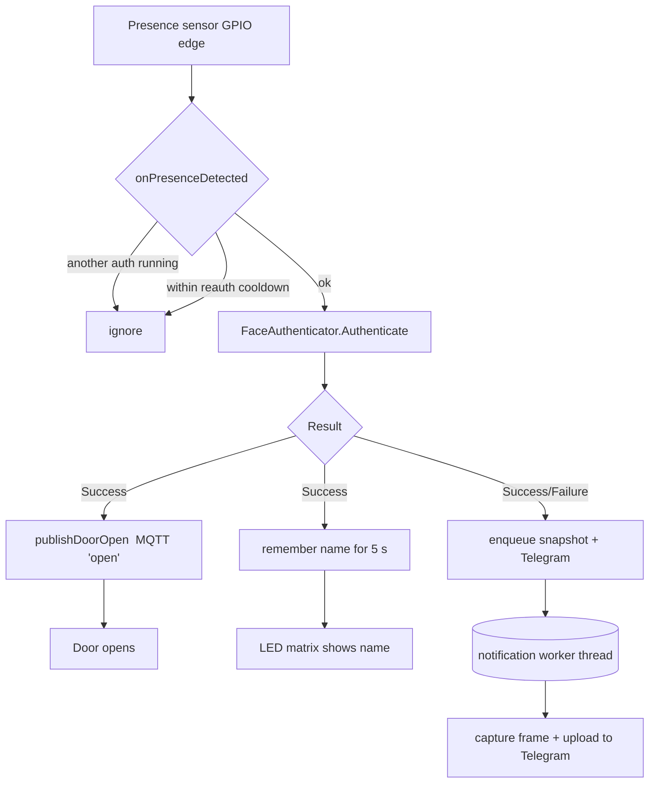

# smartdoorF455 — Developer & User Guide

A face-recognition door opener for the Raspberry Pi built around the **Intel
RealSense ID F45x** camera. When an authorized face is recognized, the door is
opened (via an MQTT command), an optional Telegram notification/snapshot is
sent, and the recognized name is shown briefly on an RGB LED matrix that
otherwise displays a clock.

This guide covers three things:

1. [Application flow](#1-application-flow) — what happens at runtime
2. [Code structure](#2-code-structure) — how the source is organized
3. [User manual](#3-user-manual) — building, configuring and running it

> The API-level reference (classes, members, call graphs) is generated by
> Doxygen into [`docs/html`](html/index.html). This document is the
> higher-level, human-readable companion to it.

---

## 1. Application flow

### 1.1 Overview

smartdoorF455 is an event-driven daemon. A GPIO **presence sensor** decides
*when* to attempt a recognition; the RealSense ID camera decides *who* is at the
door; and the results fan out to the door (MQTT), the operator (Telegram) and
the display (LED matrix).



### 1.2 Startup — `Application::initialize()`

Called once from `main()` with the path to `config.toml`:

1. **Load config** — parse the TOML file (`Config::loadFile`). Any subsequent
   lookup falls back to a documented default if the key is missing.
2. **GPIO** (`initWiringPi`) — set up WiringPi in BCM pin mode, configure the
   sensor pin as input with the configured pull-up/down, and register
   `presenceDetectedCallback` as an interrupt handler on **both** signal edges.
3. **Camera** (`initCamera`) — discover the RealSense ID device, connect over
   its serial port, and push the device configuration (rotation, security
   level, algo flow, …) derived from the `[camera]` section.
4. **MQTT** (`initMosquitto`, optional) — connect to the broker and subscribe to
   the door/control topics.
5. **Telegram** (`initTelegram`, optional) — create the bot with a bounded HTTP
   timeout and send a "started" message.
6. **LED matrix** (`MatrixDisplay::start`) — load fonts and start the render
   loop. If the panel or fonts are unavailable it **degrades gracefully** to
   headless mode (the rest of the app keeps working).
7. **Notification worker** — start the background thread that performs all
   Telegram / snapshot I/O (see [1.5](#15-the-notification-worker)).

If any *required* step fails, `initialize()` returns `false` and the process
exits with a non-zero status.

### 1.3 Main loop — `Application::run()`

`run()` installs handlers for `SIGINT`/`SIGTERM` and then simply waits until an
interrupt is requested. All real work happens on other threads:

- the **WiringPi interrupt thread** (presence → authentication),
- the **matrix render thread** (periodic clock/name drawing),
- the **notification worker thread** (Telegram/snapshot).

### 1.4 A recognition attempt — `onPresenceDetected()`

Runs on the WiringPi interrupt thread whenever the sensor changes state:

1. **Concurrency guard** — an atomic flag rejects re-entry while an attempt is
   already in progress.
2. **Reauthentication cooldown** — after the first attempt, a new one is only
   allowed once `wait_time_until_reauthentication` seconds have elapsed since
   the previous trigger.
3. **Authenticate** — call the RealSense ID SDK synchronously; it invokes
   `AuthCallback` which forwards the result to
   `Application::handleAuthenticationResult`.
4. On **Success**: remember the user name (shown on the matrix for 5 s), publish
   the door-open command over MQTT, and queue a Telegram "Door opened for …"
   message. On **failure**: queue an "unauthorized" Telegram message.
5. If snapshots are enabled, **enqueue** a snapshot+upload task.

> **Why the snapshot/Telegram work is queued, not run inline:** the interrupt
> thread is the *only* thread that can react to the presence sensor. Doing a
> network upload there once froze recognition for up to two minutes when the
> Telegram request stalled. Offloading that work to the notification worker
> keeps re-authentication responsive — the only wait between attempts is the
> intended cooldown.

### 1.5 The notification worker

A single background thread drains a bounded FIFO queue of tasks
(`enqueueNotification` → `notificationWorkerLoop`). All access to the Telegram
`bot_` happens here, so there are no data races, and a slow or hung upload never
blocks door handling. If the queue is saturated (network down), the oldest
pending task is dropped rather than letting work pile up. Every Telegram request
is additionally capped by a send timeout.

### 1.6 The display

`MatrixDisplay` runs its own periodic render loop (`update_interval_ms`) that
draws, on a 64×32 RGB panel:

- the current time (`HH:MM`), weekday and date, and
- the most recently authenticated user name, for a few seconds after a success.

The name is provided through a thread-safe callback into the `Application`, which
auto-expires it after `NAME_DISPLAY_TIMEOUT_SEC` (5 s).

### 1.7 Shutdown — `cleanup()`

On `SIGINT`/`SIGTERM` the wait loop exits and `cleanup()` runs (guarded so it
only runs once): stop the notification worker, stop the matrix, disconnect MQTT,
and disconnect the camera.

---

## 2. Code structure

All application source lives in [`src/`](../src). It is a small, focused C++17
codebase (~1.2k lines) split by responsibility:

| File | Responsibility |
|------|----------------|
| [`main.cpp`](../src/main.cpp) | Entry point. Resolves the config path (arg or `./config.toml`) and runs the `Application`. |
| [`application.hpp`](../src/application.hpp) / [`application.cpp`](../src/application.cpp) | The orchestration layer — `Application`, the SDK callback bridge `AuthCallback`, the GPIO trampoline `presenceDetectedCallback`, and the notification worker. |
| [`config.hpp`](../src/config.hpp) / [`config.cpp`](../src/config.cpp) | `Config` — typed access to TOML values (`getBool/getInt/getLong/getString/getColor`) and translation of the `[camera]` section into a RealSense ID `DeviceConfig`. |
| [`matrix_display.hpp`](../src/matrix_display.hpp) / [`matrix_display.cpp`](../src/matrix_display.cpp) | `MatrixDisplay` — LED panel setup, font resolution, and the clock/name render loop, with a safe headless fallback. |

### 2.1 Key types

- **`Application`** — owns every subsystem and the runtime state (camera,
  matrix, bot, MQTT handle, cooldown timers, the notification queue). Public
  surface: `initialize()`, `run()`, and the callback entry points
  (`onPresenceDetected`, `handleAuthenticationResult`).
- **`AuthCallback`** — implements the RealSense ID `AuthenticationCallback`
  interface and forwards results back to the `Application`.
- **`Config`** — a thin, defensive wrapper over
  [toml++](https://github.com/marzer/tomlplusplus): every getter takes a
  dotted path (e.g. `"camera.security_level"`) and a default.
- **`MatrixDisplay`** — wraps
  [rpi-rgb-led-matrix](https://github.com/hzeller/rpi-rgb-led-matrix) and a
  periodic executor; it reads its colors/mapping from the `[matrix_options]`
  section.

### 2.2 Threading model

| Thread | Created by | Does |
|--------|-----------|------|
| main | `main()` | init, then waits for shutdown |
| WiringPi interrupt | `wiringPiISR2` | presence → `Authenticate` → result fan-out (fast, non-blocking) |
| matrix render | `PeriodicExecutor` | draws the clock/name every `update_interval_ms` |
| notification worker | `Application` | snapshot capture + all Telegram sends |

The recognized-name state is shared between the interrupt thread (writer) and
the render thread (reader) under a mutex; the notification queue has its own
mutex + condition variable.

### 2.3 External dependencies

Pulled in automatically by CMake (`FetchContent` / `ExternalProject`), so a
clean checkout builds without manual dependency installation beyond the system
libraries (OpenCV, OpenSSL, mosquitto, Boost):

RealSense ID SDK, tgbot-cpp (Telegram), toml++, WiringPi, rpi-rgb-led-matrix,
and PeriodicExecutor. See the header comment in
[`src/CMakeLists.txt`](../src/CMakeLists.txt) for the exact repositories/tags.

### 2.4 Project layout

```
smartdoorF455/
├── src/            application source + CMake + Doxygen config
├── bin/            run scripts, config.toml(.example), and the built binary
├── fonts/          BDF fonts for the LED matrix (copied here at build time)
├── log/            runtime logs + PID file (git-ignored)
├── docs/           generated API docs (html/latex) + this guide
├── build/          CMake build tree (git-ignored)
└── external/       fetched dependencies (git-ignored)
```

---

## 3. User manual

### 3.1 Hardware

- Raspberry Pi (tested on a Pi 4, 64-bit).
- Intel RealSense ID **F45x** camera (USB).
- A presence sensor wired to a GPIO pin (PIR/IR/proximity — anything that
  produces a clean edge when someone approaches).
- Optional: a 64×32 RGB LED matrix panel (HUB75), e.g. via an Adafruit Bonnet.
- Optional: an MQTT broker that drives your door relay, and a Telegram bot.

### 3.2 Build

The build fetches and compiles all third-party libraries the first time, which
takes a while on a Pi.

```bash
# from the project root
cmake --preset default        # configure (clones dependencies)
cmake --build build -j4       # build; binary is produced in bin/smartdoorF455
```

The build also copies the required fonts into [`fonts/`](../fonts).

> If you do not use the preset, the equivalent is
> `cmake -S . -B build -DCMAKE_BUILD_TYPE=Debug && cmake --build build -j4`.

### 3.3 Configure

Copy the annotated example and edit it:

```bash
cp bin/config.toml.example bin/config.toml
$EDITOR bin/config.toml
```

Sections (all keys have safe defaults; see the example file for inline docs):

- **`[raspi]`** — `gpio_sensor_pin`, `gpio_sensor_pull`
  (`0`=off/`1`=down/`2`=up), and `wait_time_until_reauthentication` (seconds of
  cooldown between attempts).
- **`[camera]`** — `camera_rotation`, `security_level`, `algo_flow`,
  `dump_mode`, `matcher_confidence_level`, `frontal_face_policy`, `max_spoofs`,
  `gpio_auth_toggling`. These map directly onto the RealSense ID device config.
- **`[matrix_options]`** — `hardware_mapping`, `brightness`,
  `pixel_mapper_config`, the various `*_color` triples, `update_interval_ms`,
  and an optional `font_dir` (leave unset to auto-locate the fonts).
- **`[mosquitto]`** — `use_mosquitto`, `host`, `port`, `keepalive`,
  `topic_door` (where the `open` command is published) and `topic_control`.
- **`[telegram]`** — `use_telegram`, `bot_token`, `chat_id`, and
  `send_snapshot` (send a photo of each attempt — mind privacy/GDPR).

> `bin/config.toml` is git-ignored because it contains secrets (bot token). Keep
> only `bin/config.toml.example` under version control.

### 3.4 Run

Use the management script in [`bin/`](../bin):

```bash
cd bin
./run_smartdoorF455.sh start        # start in the background
./run_smartdoorF455.sh status       # is it running?
./run_smartdoorF455.sh restart      # stop then start
./run_smartdoorF455.sh stop         # stop
./run_smartdoorF455.sh foreground   # run attached to the terminal
```

Options: `--config PATH`, `--logdir PATH`, `--no-taskset`.

- Logs and the PID file are written to [`log/`](../log) at the project root.
- Snapshots (if enabled) are written under `~/smartdoorF455/snapshots`.
- For flicker-free LED output the binary wants the `cap_sys_nice` capability;
  the start script offers to set it (needs `sudo`). Without it the matrix still
  works but colors may be less stable.

### 3.5 Behavior you will observe

- Approach the sensor → the camera attempts recognition.
- On a match: the door opens (MQTT `open`), your name appears on the panel for
  ~5 s, and (if enabled) a Telegram message/photo arrives.
- On no match / no face: nothing opens; an "unauthorized" Telegram message is
  sent if enabled.
- A new attempt is possible once the `wait_time_until_reauthentication` cooldown
  elapses and the sensor fires again.

### 3.6 Troubleshooting

| Symptom | Likely cause / fix |
|---------|--------------------|
| "No RealSenseID devices found" | Camera not detected on USB; re-seat, check `lsusb`, check permissions on the serial device. |
| Matrix stays blank, log says "failed to load matrix fonts" | Fonts not found; ensure [`fonts/`](../fonts) exists (rebuild regenerates it) or set `matrix_options.font_dir`. |
| Colors flicker | Run with `cap_sys_nice` (the start script sets it) or as root. |
| Door never opens on success | Check `[mosquitto]` broker reachability and that `topic_door` drives your relay. |
| Telegram messages missing | Verify `bot_token`/`chat_id`; the bot must be a member of the target chat. |
| Can't re-authenticate immediately | Expected: the `wait_time_until_reauthentication` cooldown must pass and the sensor must fire again. |

### 3.7 Regression test for the run script

```bash
cd bin
./test_run_smartdoorF455.sh    # exercises start/status/stop with a stub binary
```

### 3.8 Regenerate the API docs

```bash
cmake --build build --target doc   # runs Doxygen; output in docs/html and docs/latex
```
